<!-- SPDX-License-Identifier: GPL-3.0-or-later -->

# hpd — Guía visual (para dummies) 🇪🇸🖼️

Los manuales en imágenes. Una imagen dice más que mil palabras, así que
acá está **cómo funciona el daemon**, **cómo funciona el plugin de Decky**,
y **cómo se comunican** — con todas las combinaciones posibles. English
version: [`DIAGRAMS.md`](DIAGRAMS.md).

> Los diagramas son [Mermaid](https://mermaid.js.org): se ven solos en
> GitHub y en la mayoría de editores Markdown.

**Índice**

- [0. La idea en una imagen](#0-la-idea-en-una-imagen)
- [1. El daemon por dentro](#1-el-daemon-por-dentro)
- [2. El plugin por dentro](#2-el-plugin-por-dentro)
- [3. Comunicación plugin ↔ daemon](#3-comunicación-plugin--daemon)
- [4. Todas las combinaciones](#4-todas-las-combinaciones)
- [5. Tabla maestra: CLI ↔ D-Bus ↔ Plugin](#5-tabla-maestra-cli--d-bus--plugin)

---

## 0. La idea en una imagen

**Tres perillas independientes.** Esto es lo único que hay que entender:

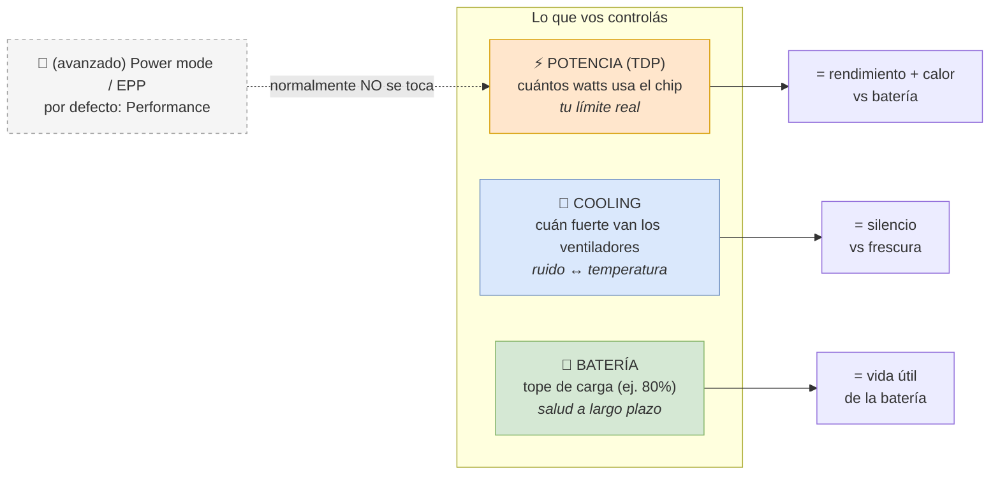

**Regla mental:**
- ¿Más/menos rendimiento o batería? → **TDP**.
- ¿Más/menos ruido? → **Cooling**.
- Son **independientes**: "potencia full + ventilador silencioso" es válido.

---

## 1. El daemon por dentro

`hpd` es un servicio de fondo (root) que escribe los "perillas" del firmware
y expone una interfaz D-Bus. Por dentro **todo pasa por una máquina de
estados**: nada toca el hardware directo.

### 1.1 El flujo de un comando (máquina de estados)

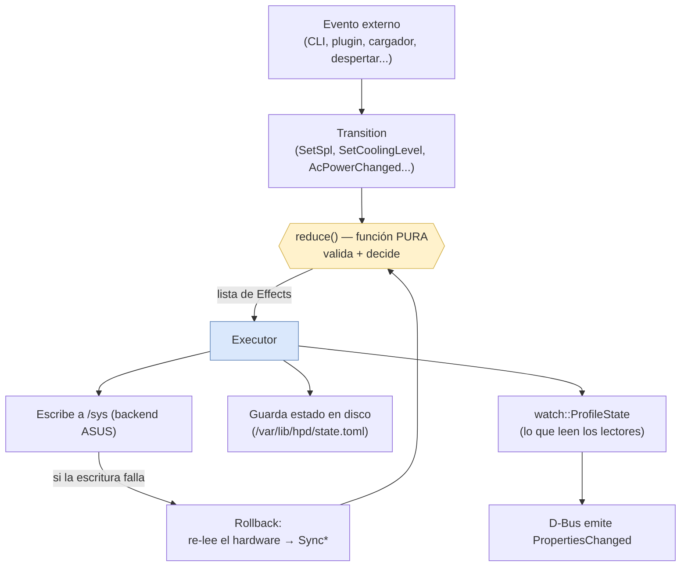

**Para dummies:** un evento se convierte en una "intención" (Transition),
una función pura decide qué hacer (sin tocar nada), y el Executor es el
único que escribe al hardware y guarda el estado. Si una escritura falla,
re-lee el hardware para no mentir sobre el estado.

### 1.2 El desacople: qué perilla escribe qué

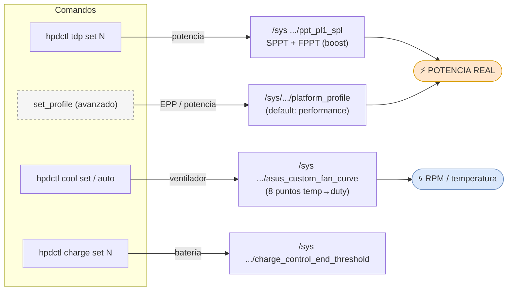

> 🔑 **El cambio clave (desacople):** antes `cool` movía *también* el
> `platform_profile`, que **capa la potencia real** (un `silent` dejaba el
> chip a ~13 W aunque pidieras 25 W). Ahora `cool` solo toca el ventilador;
> el `platform_profile` queda fijo en `performance` para que tu TDP sea el
> límite de verdad.

### 1.3 Auto-cooling: el ventilador sigue al TDP

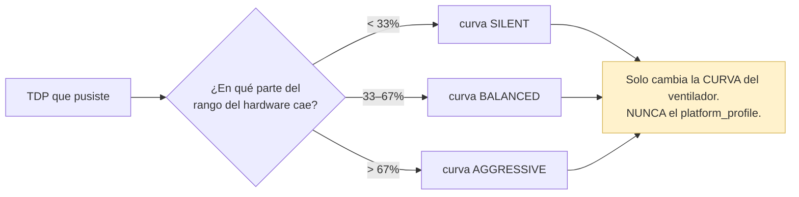

### 1.4 Ciclo de vida (eventos del sistema)

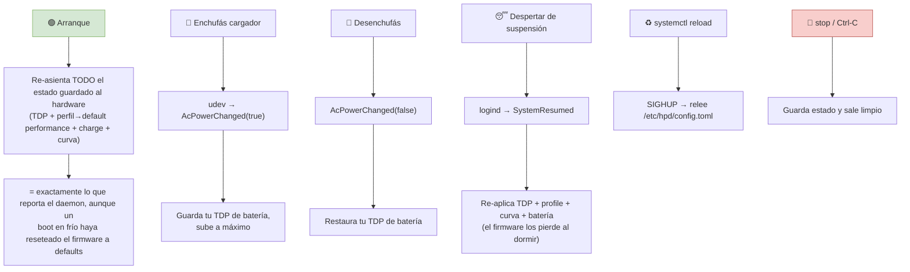

### 1.5 ¿Hay alguien peleando por las perillas? (rivales)

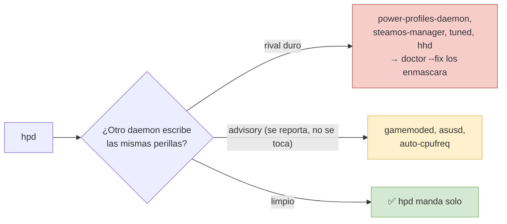

---

## 2. El plugin por dentro

El plugin de Decky es **una UI** en el menú rápido de Steam. No toca el
hardware: le pide todo al daemon. Tiene tres capas.

### 2.1 Las tres capas del plugin

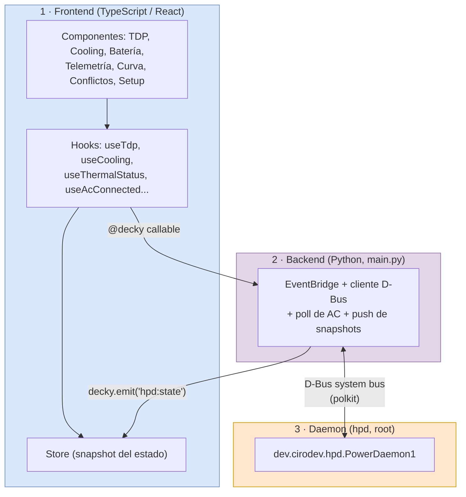

**Para dummies:** los botones (TS) le hablan al backend Python; el Python
le habla al daemon por D-Bus; y cuando algo cambia, el Python le **empuja**
el estado nuevo a la UI para que se actualice sola.

### 2.2 Mapa de la pantalla del plugin

```mermaid
flowchart TB
    PANEL["📱 Panel hpd (Quick Access)"]
    PANEL --> SETUP["⚠️ Banner de Setup<br/>(si falta polkit → fix-polkit)"]
    PANEL --> CONF["⚠️ Banner de Conflictos<br/>(si hay un rival → resolver)"]
    PANEL --> PWR["⚡ TDP — slider + presets (Eco/Balanced/Max)"]
    PANEL --> COOL["🧊 Cooling — Auto / Silent / Balanced / Aggressive + Reset"]
    PANEL --> BAT["🔋 Tope de batería"]
    PANEL --> TEL["📊 Telemetría — W ahora / temps / RPM"]
    PANEL --> GRAPH["📈 Gráfico de la curva de ventilador"]
    PANEL --> ADV["🔧 Avanzado — Power mode (perfil), curva cruda"]
    PANEL --> AC["🔌 Indicador AC"]
    PANEL --> HELP["❓ Ayuda"]

    style PWR fill:#ffe6cc,stroke:#d79b00
    style COOL fill:#dae8fc,stroke:#6c8ebf
    style BAT fill:#d5e8d4,stroke:#82b366
    style ADV fill:#f5f5f5,stroke:#999,stroke-dasharray: 4 4
```

### 2.3 Dos formas de mantenerse al día: reactivo vs polling

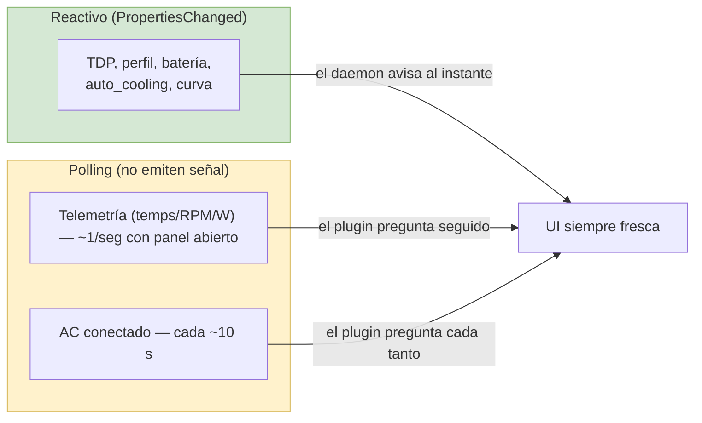

> 💡 El **AC** se consulta por polling porque el daemon no emite señal para
> él. El **fix del nodo `AC0`** hace que esa consulta devuelva el valor
> correcto en el Xbox Ally X (antes decía "batería" siempre).

---

## 3. Comunicación plugin ↔ daemon

### 3.1 Mapa de comunicación (quién llama a qué)

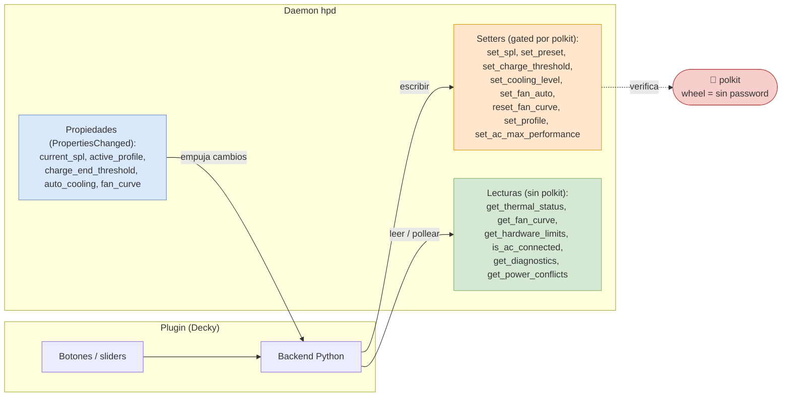

### 3.2 Caso de uso — cambiar el TDP desde el plugin

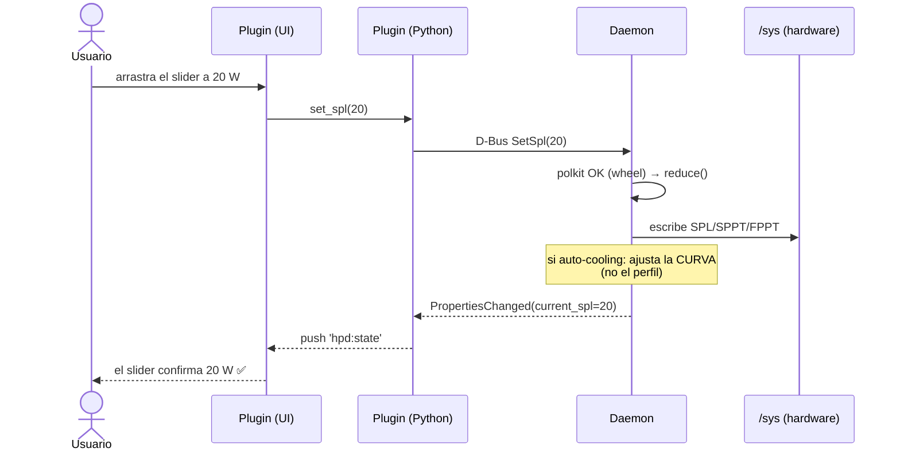

### 3.3 Caso de uso — cambiar cooling (solo ventilador)

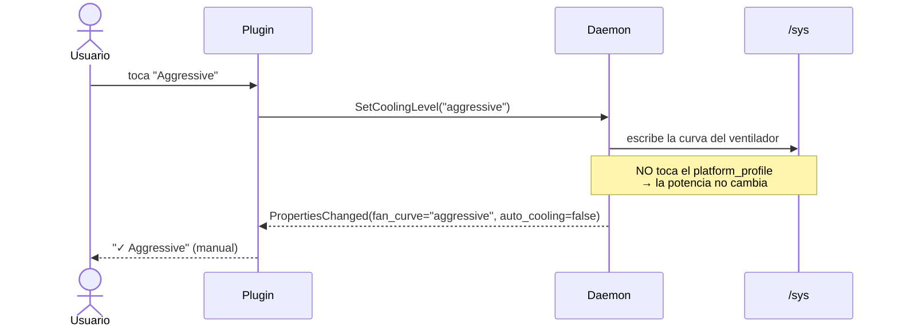

### 3.4 Caso de uso — optar por el auto-follow de clock de GPU (avanzado)

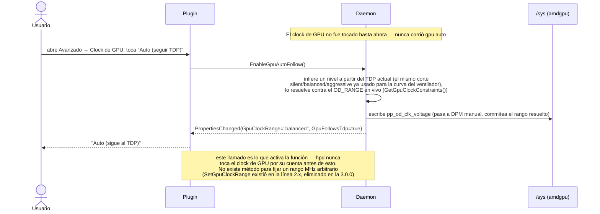

### 3.5 Caso de uso — enchufar el cargador

```mermaid
sequenceDiagram
    participant K as Kernel (udev)
    participant D as Daemon
    participant PY as Plugin (Python)
    participant UI as Plugin (UI)

    K->>D: evento power_supply (AC0 online=1)
    D->>D: AcPowerChanged(true) → snapshot estado DC, fuerza Performance / Max / Aggressive, set AcLocked
    D-->>PY: PropertiesChanged: AcConnected=true, AcLocked=true, CurrentSpl, ActiveProfile, FanCurve
    PY-->>UI: indicador "⚡ AC" + deshabilita TDP / preset / power-mode / cooling (carga sigue editable)
    Note over D,UI: mientras AcLocked, el daemon rechaza escrituras de potencia/cooling; al desenchufar restaura el snapshot DC
```

### 3.6 Caso de uso — cambio externo (hpdctl en una terminal)

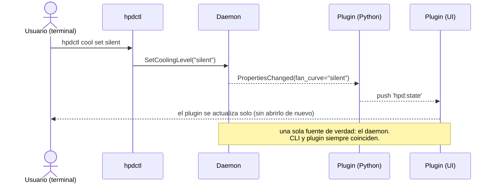

### 3.7 Caso de uso — falta polkit / hay un rival

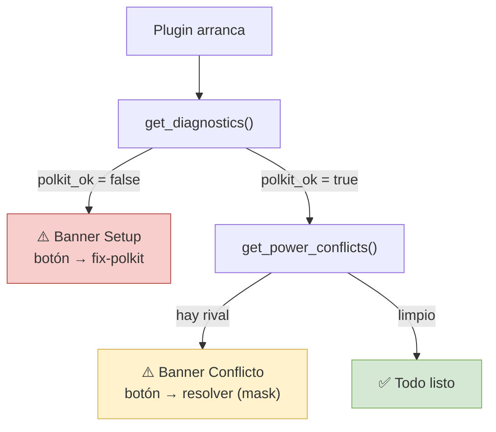

---

## 4. Todas las combinaciones

Como **potencia y cooling son independientes**, cualquier mezcla es válida.
La temperatura la decide el **TDP**; el ruido lo decide el **cooling**.

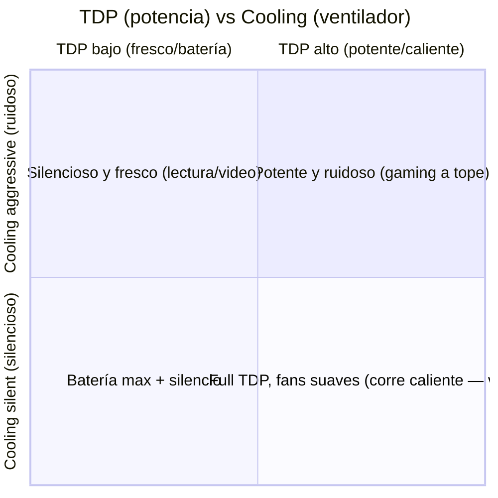

### 4.1 Matriz de combinaciones (qué obtenés)

| TDP | Cooling | Resultado |
|---|---|---|
| Bajo (eco) | Silent | 🟢 Frío, silencioso, mucha batería |
| Bajo (eco) | Aggressive | Frío y silencioso igual (poca carga) + fans fuertes "de más" |
| Alto (max) | Aggressive | 🔥 Máximo rendimiento, lo más fresco posible a tope, ruidoso |
| Alto (max) | Silent | Potencia full pero corre **caliente** (poco aire) — válido, es tu decisión |
| Cualquiera | **Auto** | El ventilador se ajusta solo al TDP (recomendado) |

### 4.2 La perilla avanzada de potencia (platform_profile)

| Power mode | Efecto | Para quién |
|---|---|---|
| **Performance** *(default)* | Tu TDP se aplica completo | 👍 Casi todos |
| Balanced | Limita un poco la potencia (eficiencia) | Avanzados |
| Power-saver / Eco | Limita fuerte la potencia (por debajo del TDP) | Avanzados que quieren máxima eficiencia |

> ⚠️ Si ponés **Power-saver**, el chip puede quedar por debajo de tu TDP
> (es la única perilla que "pisa" el TDP). El plugin avisa con un hint si
> detecta esto. **Cooling nunca limita la potencia.**

### 4.3 Auto vs Manual (cooling)

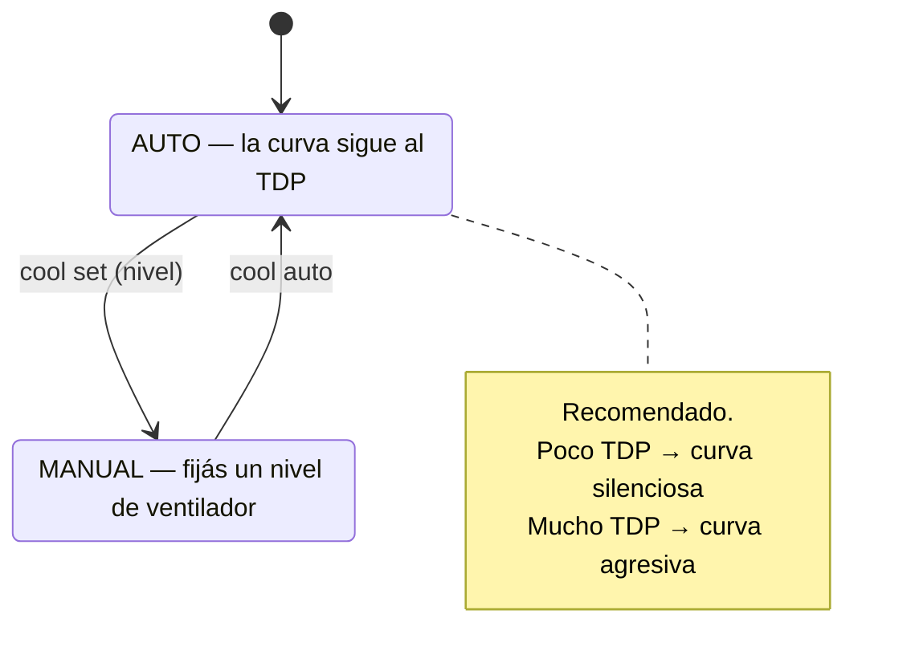

---

## 5. Tabla maestra: CLI ↔ D-Bus ↔ Plugin

Cómo se llama lo mismo en cada lado (todo termina en el daemon):

| Acción | `hpdctl` | D-Bus | Plugin (UI) | polkit |
|---|---|---|---|---|
| **Potencia** | `tdp set <W>` | `SetSpl(u)` | slider TDP | `set-tdp` |
| Preset de potencia | `preset eco/balanced/max` | `SetPreset(s)` | botones Eco/Balanced/Max | `set-tdp` |
| **Cooling (ventilador)** | `cool set <nivel>` | `SetCoolingLevel(s)` | selector Cooling | `set-profile` |
| Cooling automático | `cool auto` | `SetFanAuto()` | toggle Auto | `set-profile` |
| Cooling a firmware | `cool reset` | `ResetFanCurve()` | botón Reset | `set-profile` |
| **Power mode (avanzado)** | `power set <modo>` | `SetProfile(s)` | Avanzado → Power mode | `set-profile` |
| **AC lock** | `ac-lock on/off` | `SetAcMaxPerformance(b)` | toggle en Settings | `set-profile` |
| **Batería** | `charge set <%>` | `SetChargeThreshold(y)` | control de batería | `set-charge` |
| Ver temps/RPM/W | `status` / `monitor` | `GetThermalStatus()` | telemetría (poll) | — |
| Ver curva | `cool curve` | `GetFanCurve()` | gráfico | — |
| Ver rango HW | `limits` | `GetHardwareLimits()` | rango del slider | — |
| Ver AC | `status` | `AcConnected` (prop) / `IsAcConnected()` | indicador (reactivo) | — |
| Ver AC lock | `ac-lock` | `AcLocked` / `AcMaxPerformance` (props) | banner + toggle en Settings | — |
| Salud / polkit | `doctor` | `GetDiagnostics()` | banner Setup | — |
| Rivales | `doctor` | `GetPowerConflicts()` | banner Conflicto | — |
| Curva custom (avanzado) | `cool set-custom <8 pares>` | `SetFanCurve(a(yy), a(yy))` | Editor de curva | `set-profile` |
| Telemetría extendida | `status` / `monitor` | `GetTelemetry()` | Sección de telemetría extendida | — |
| **Clock de GPU (avanzado, opt-in)** | `gpu auto` | `EnableGpuAutoFollow()` | Avanzado → Clock de GPU → Auto | `set-profile` |
| Clock de GPU — reset | `gpu reset` | `ResetGpuClocks()` | Avanzado → Clock de GPU → Reset | `set-profile` |
| Clock de GPU — lectura | `gpu get` | `GetGpuClockRange()` / `GpuClockRange` (prop) | Control de clock de GPU (reactivo) | — |
| Clock de GPU — límites | `gpu limits` | `GetGpuClockConstraints()` | Control de clock de GPU (límites) | — |

---

**Manuales completos:** [`MANUAL-es.md`](MANUAL-es.md) ·
[`COOLING-es.md`](COOLING-es.md) (el desacople explicado) ·
[`fan-curves.md`](fan-curves.md) (lo técnico de las curvas) ·
[`decky-plugin/`](decky-plugin/) (la integración del plugin).
