<!-- SPDX-License-Identifier: GPL-3.0-or-later -->

# hpd — Visual guide (for dummies) 🖼️

The manuals, in pictures. A picture is worth a thousand words, so here is
**how the daemon works**, **how the Decky plugin works**, and **how they
talk to each other** — with every possible combination. Spanish version:
[`DIAGRAMS-es.md`](DIAGRAMS-es.md).

> The diagrams are [Mermaid](https://mermaid.js.org): they render on their
> own in GitHub and most Markdown editors.

**Contents**

- [0. The whole idea in one picture](#0-the-whole-idea-in-one-picture)
- [1. Inside the daemon](#1-inside-the-daemon)
- [2. Inside the plugin](#2-inside-the-plugin)
- [3. Plugin ↔ daemon communication](#3-plugin--daemon-communication)
- [4. Every combination](#4-every-combination)
- [5. Master table: CLI ↔ D-Bus ↔ Plugin](#5-master-table-cli--d-bus--plugin)

---

## 0. The whole idea in one picture

**Three independent knobs.** This is the only thing you must understand:

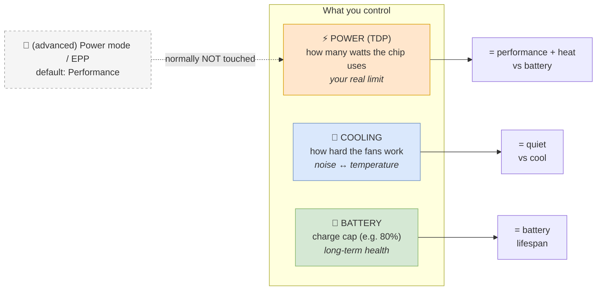

**Mental rule:**
- More/less performance or battery? → **TDP**.
- More/less noise? → **Cooling**.
- They are **independent**: "full power + quiet fans" is valid.

---

## 1. Inside the daemon

`hpd` is a background service (root) that writes the firmware "knobs" and
exposes a D-Bus interface. Internally **everything goes through a state
machine** — nothing touches the hardware directly.

### 1.1 The flow of a command (state machine)

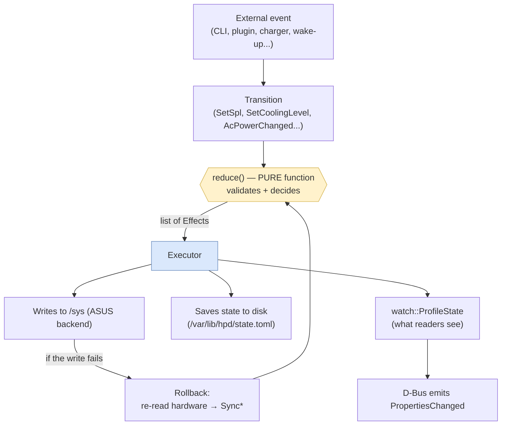

**For dummies:** an event becomes an "intent" (Transition), a pure
function decides what to do (touching nothing), and the Executor is the
only thing that writes hardware and saves state. If a write fails, it
re-reads the hardware so it never lies about the state.

### 1.2 The decouple: which knob writes what

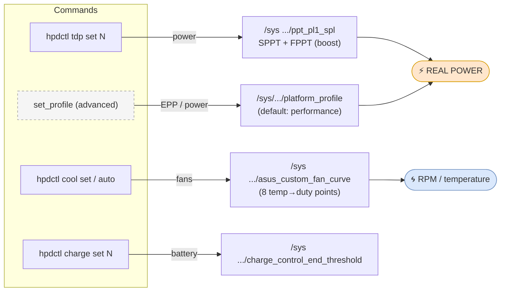

> 🔑 **The key change (decouple):** `cool` used to *also* move the
> `platform_profile`, which **clamps real power** (a `silent` level left
> the chip at ~13 W even if you asked for 25 W). Now `cool` only touches
> the fans; the `platform_profile` stays at `performance` so your TDP is
> the real limit.

### 1.3 Auto-cooling: the fans follow the TDP

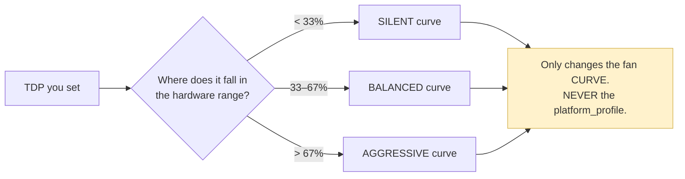

### 1.4 Lifecycle (system events)

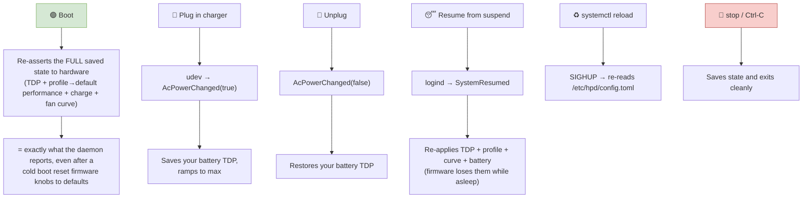

### 1.5 Is anyone fighting over the knobs? (rivals)

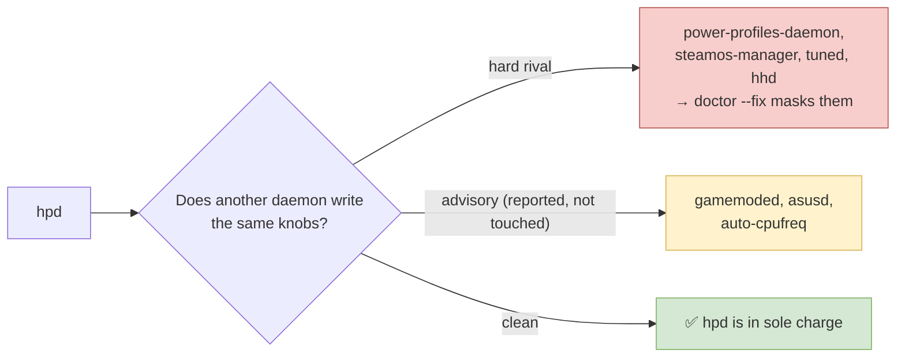

---

## 2. Inside the plugin

The Decky plugin is **a UI** in Steam's Quick Access menu. It never
touches the hardware: it asks the daemon for everything. It has three
layers.

### 2.1 The plugin's three layers

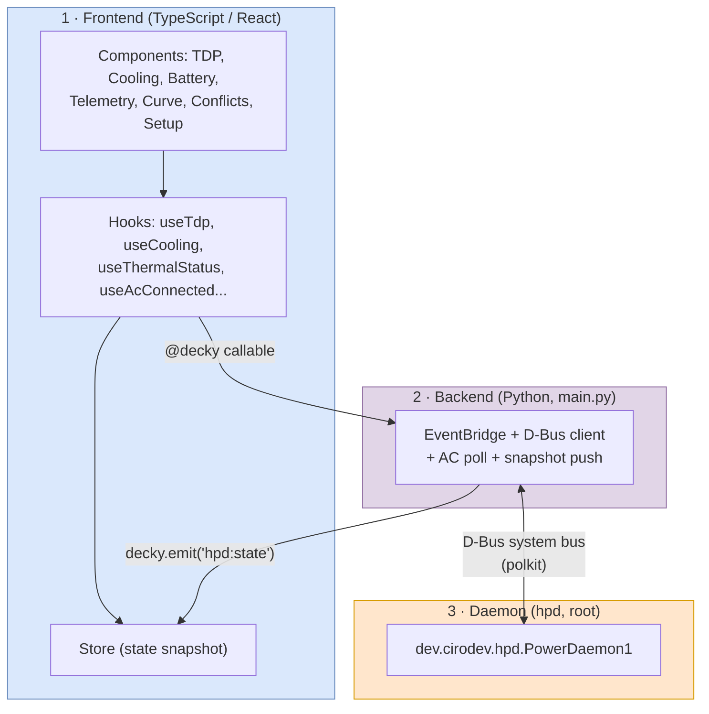

**For dummies:** the buttons (TS) talk to the Python backend; the Python
talks to the daemon over D-Bus; and when something changes, the Python
**pushes** the new state to the UI so it updates on its own.

### 2.2 Map of the plugin screen

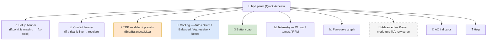

### 2.3 Two ways to stay current: reactive vs polling

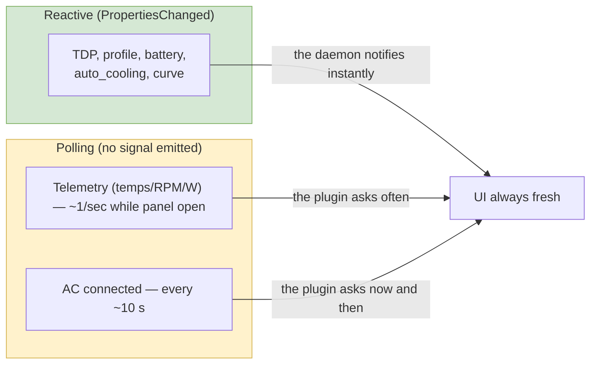

> 💡 **AC** is polled because the daemon emits no signal for it. The
> **`AC0`-node fix** makes that poll return the correct value on the Xbox
> Ally X (it used to always say "battery").

---

## 3. Plugin ↔ daemon communication

### 3.1 Communication map (who calls what)

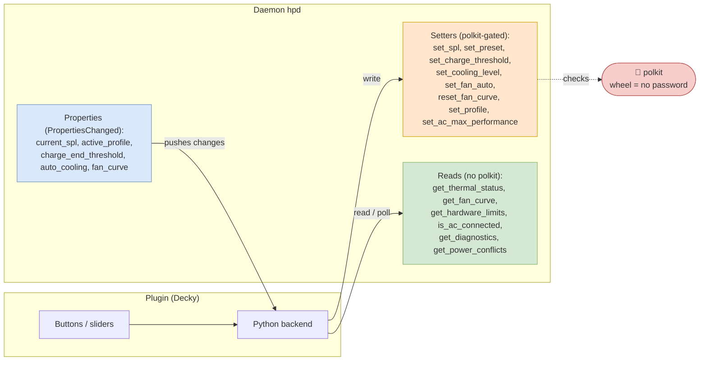

### 3.2 Use case — change the TDP from the plugin

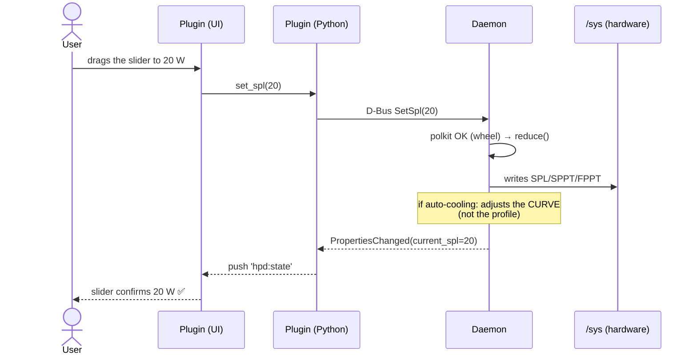

### 3.3 Use case — change cooling (fans only)

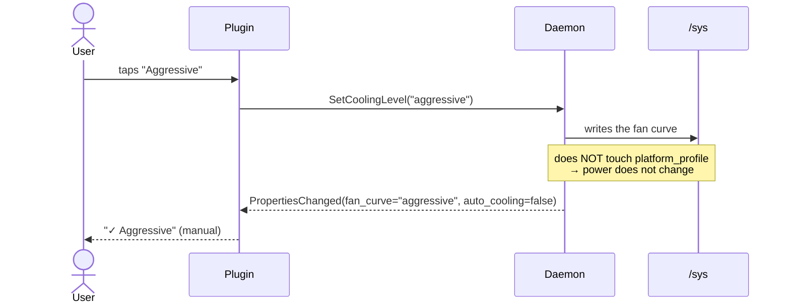

### 3.4 Use case — opt into GPU clock auto-follow (advanced)

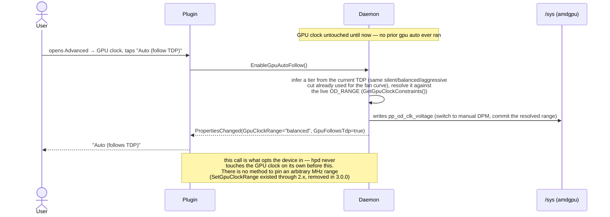

### 3.5 Use case — plug in the charger

```mermaid
sequenceDiagram
    participant K as Kernel (udev)
    participant D as Daemon
    participant PY as Plugin (Python)
    participant UI as Plugin (UI)

    K->>D: power_supply event (AC0 online=1)
    D->>D: AcPowerChanged(true) → snapshot DC state, force Performance / Max / Aggressive, set AcLocked
    D-->>PY: PropertiesChanged: AcConnected=true, AcLocked=true, CurrentSpl, ActiveProfile, FanCurve
    PY-->>UI: indicator "⚡ AC" + disable TDP / preset / power-mode / cooling (charge stays editable)
    Note over D,UI: while AcLocked, the daemon refuses power/cooling writes; unplug restores the DC snapshot
```

### 3.6 Use case — external change (hpdctl in a terminal)

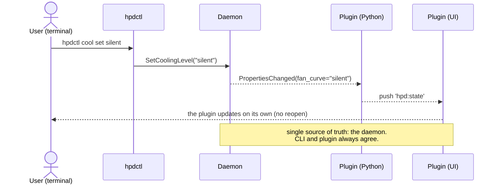

### 3.7 Use case — polkit missing / a rival is live

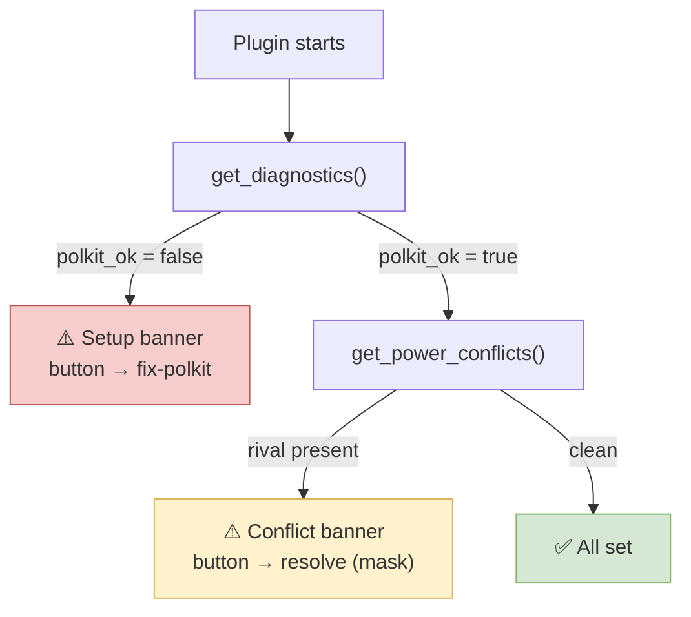

---

## 4. Every combination

Because **power and cooling are independent**, any mix is valid. The
**TDP** decides temperature; the **cooling** decides noise.

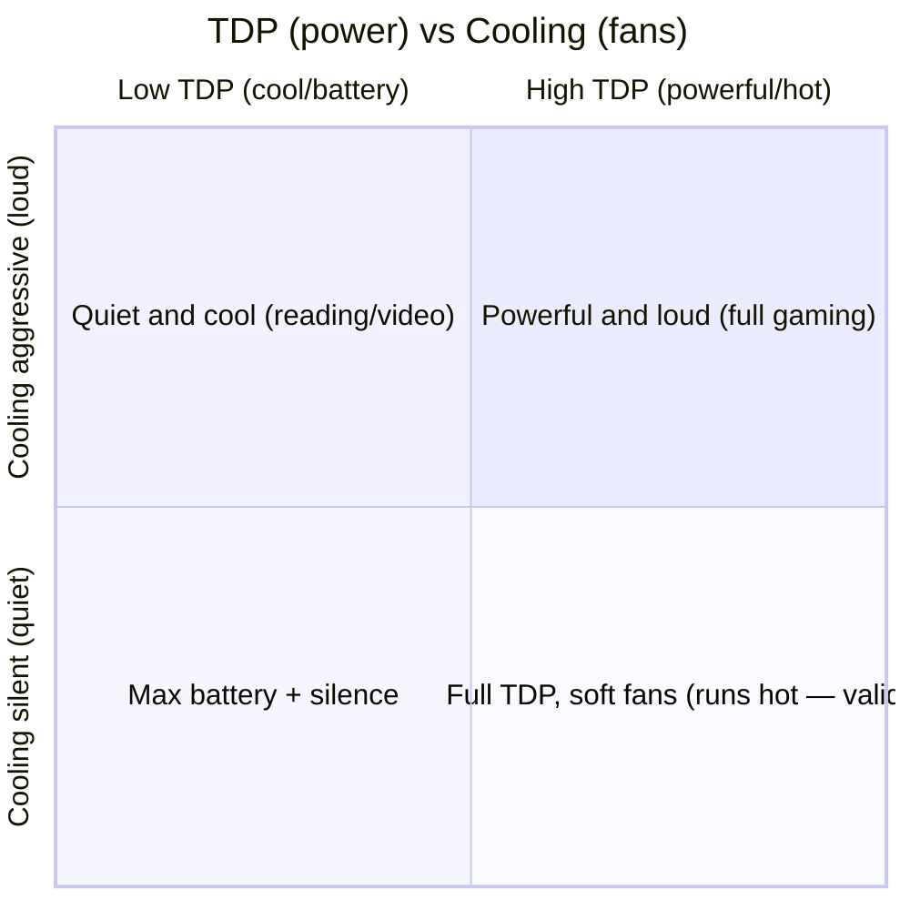

### 4.1 Combination matrix (what you get)

| TDP | Cooling | Result |
|---|---|---|
| Low (eco) | Silent | 🟢 Cool, quiet, long battery |
| Low (eco) | Aggressive | Cool and quiet anyway (light load) + fans louder than needed |
| High (max) | Aggressive | 🔥 Max performance, the coolest possible at full tilt, loud |
| High (max) | Silent | Full power but runs **hot** (little airflow) — valid, your call |
| Any | **Auto** | The fans adjust to the TDP on their own (recommended) |

### 4.2 The advanced power knob (platform_profile)

| Power mode | Effect | For whom |
|---|---|---|
| **Performance** *(default)* | Your TDP applies in full | 👍 Almost everyone |
| Balanced | Limits power a little (efficiency) | Advanced |
| Power-saver / Eco | Limits power hard (below the TDP) | Advanced users wanting max efficiency |

> ⚠️ If you set **Power-saver**, the chip can stay below your TDP (it is
> the only knob that "overrides" the TDP). The plugin shows a hint if it
> detects this. **Cooling never limits power.**

### 4.3 Auto vs Manual (cooling)

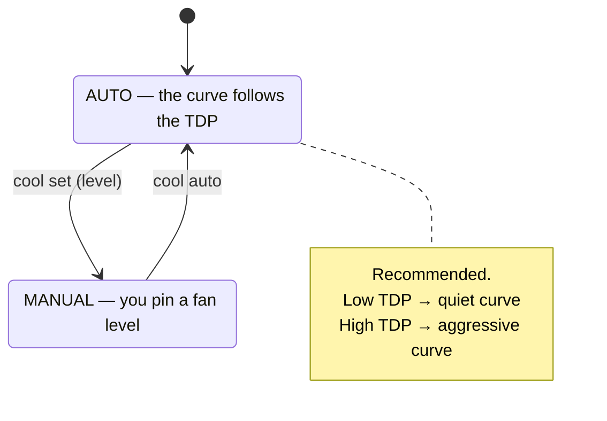

---

## 5. Master table: CLI ↔ D-Bus ↔ Plugin

What the same thing is called on each side (it all ends at the daemon):

| Action | `hpdctl` | D-Bus | Plugin (UI) | polkit |
|---|---|---|---|---|
| **Power** | `tdp set <W>` | `SetSpl(u)` | TDP slider | `set-tdp` |
| Power preset | `preset eco/balanced/max` | `SetPreset(s)` | Eco/Balanced/Max buttons | `set-tdp` |
| **Cooling (fans)** | `cool set <level>` | `SetCoolingLevel(s)` | Cooling selector | `set-profile` |
| Auto cooling | `cool auto` | `SetFanAuto()` | Auto toggle | `set-profile` |
| Cooling to firmware | `cool reset` | `ResetFanCurve()` | Reset button | `set-profile` |
| **Power mode (advanced)** | `power set <mode>` | `SetProfile(s)` | Advanced → Power mode | `set-profile` |
| **AC lock** | `ac-lock on/off` | `SetAcMaxPerformance(b)` | Settings toggle | `set-profile` |
| **Battery** | `charge set <%>` | `SetChargeThreshold(y)` | battery control | `set-charge` |
| See temps/RPM/W | `status` / `monitor` | `GetThermalStatus()` | telemetry (poll) | — |
| See curve | `cool curve` | `GetFanCurve()` | graph | — |
| See HW range | `limits` | `GetHardwareLimits()` | slider range | — |
| See AC | `status` | `AcConnected` (prop) / `IsAcConnected()` | indicator (reactive) | — |
| See AC lock | `ac-lock` | `AcLocked` / `AcMaxPerformance` (props) | banner + Settings toggle | — |
| Health / polkit | `doctor` | `GetDiagnostics()` | Setup banner | — |
| Rivals | `doctor` | `GetPowerConflicts()` | Conflict banner | — |
| Custom fan curve (advanced) | `cool set-custom <8 pairs>` | `SetFanCurve(a(yy), a(yy))` | Fan-curve editor | `set-profile` |
| Extended telemetry | `status` / `monitor` | `GetTelemetry()` | Extended telemetry section | — |
| **GPU clock (advanced, opt-in)** | `gpu auto` | `EnableGpuAutoFollow()` | Advanced → GPU clock → Auto | `set-profile` |
| GPU clock — reset | `gpu reset` | `ResetGpuClocks()` | Advanced → GPU clock → Reset | `set-profile` |
| GPU clock — read | `gpu get` | `GetGpuClockRange()` / `GpuClockRange` (prop) | GPU clock control (reactive) | — |
| GPU clock — limits | `gpu limits` | `GetGpuClockConstraints()` | GPU clock control (bounds) | — |

---

**Full manuals:** [`MANUAL.md`](MANUAL.md) (English) ·
[`MANUAL-es.md`](MANUAL-es.md) (Spanish) ·
[`fan-curves.md`](fan-curves.md) (fan-curve internals) ·
[`decky-plugin/`](decky-plugin/) (plugin integration).
