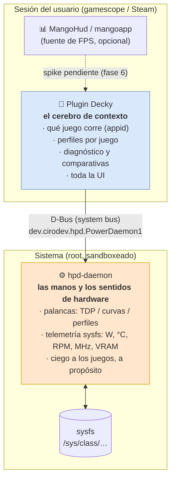
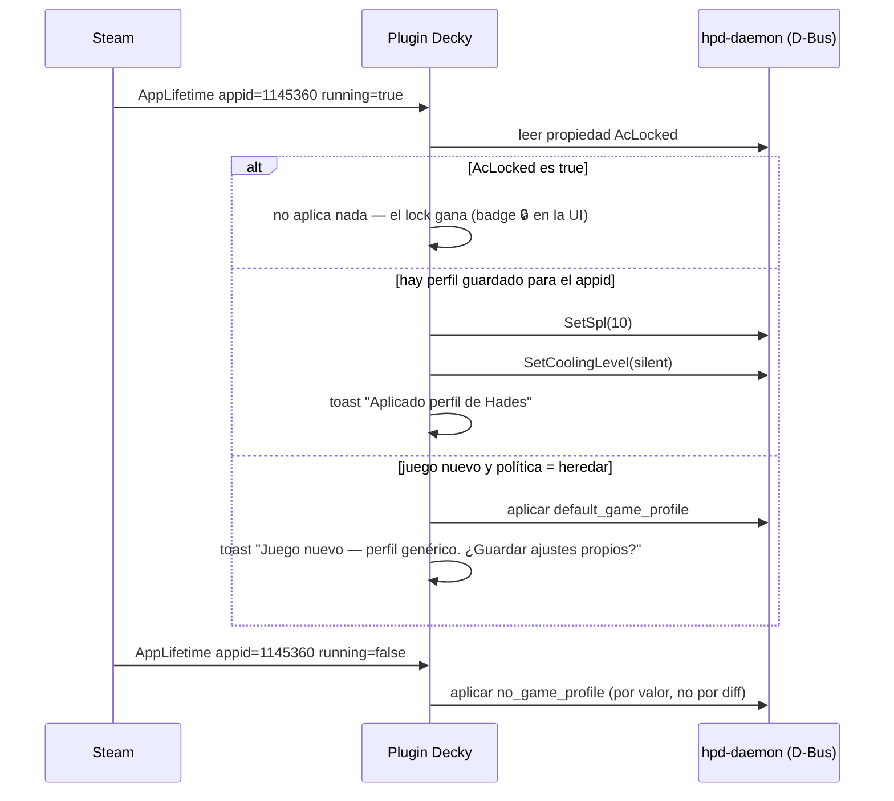
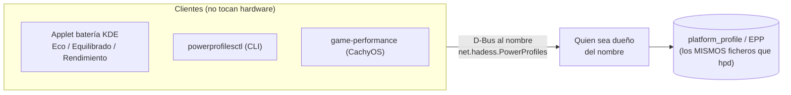
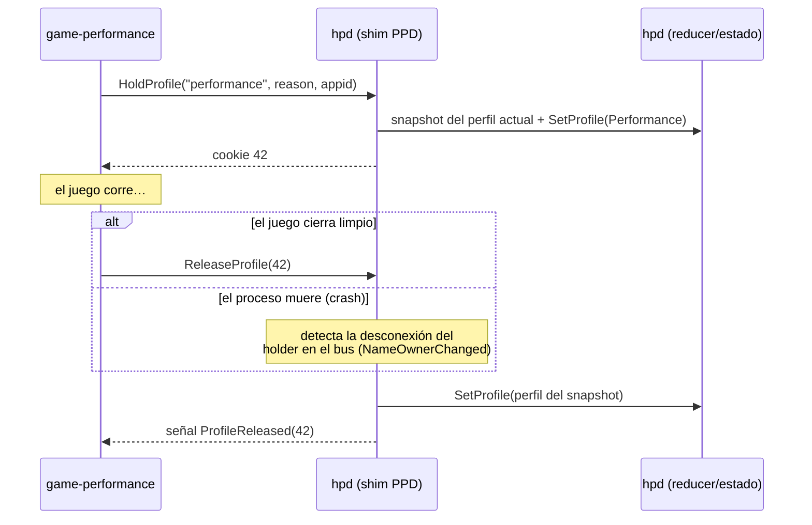
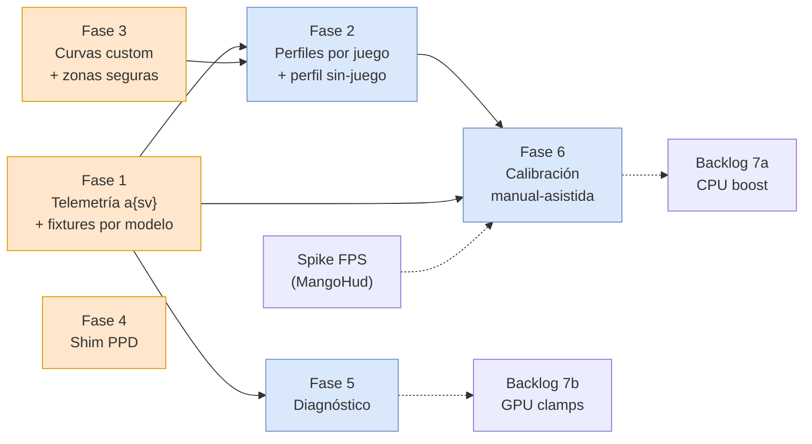

<!-- SPDX-License-Identifier: GPL-3.0-or-later -->

# hpd — Roadmap de gaming y automatización de rendimiento 🎮

> Documento de diseño, **v2** (2026-07-08, incorpora el feedback del
> mantenedor sobre la v1). Base: `main` @ v2.7.3.
> Sucesor de la §6 de [`AUDITORIA-2026-07-es.md`](AUDITORIA-2026-07-es.md).
>
> **Premisa**: si el usuario corre CachyOS en un handheld, está ahí
> para jugar lo mejor posible. Cada feature se juzga contra: *¿esto da
> más FPS, más batería, más silencio, o más entendimiento de por qué el
> juego rinde como rinde?* — **sin añadir riesgo ni complejidad que el
> usuario no pidió**.
>
> Cambios clave de la v2 respecto a la v1:
> - **Suben**: curvas de ventilador custom (ligadas a perfiles por
>   juego) y el shim PPD (todo lo que se solape con hpd es prioritario).
> - **Bajan a backlog condicionado a evidencia**: CPU boost y GPU
>   clamps (primero medir que la ganancia existe y es segura).
> - **Descartado por ahora**: auto-TDP en lazo cerrado.
> - **Fusiones**: el "modo escritorio eco" desaparece como feature —
>   es el *perfil sin-juego* de la fase 2; la salud de batería se
>   integra en la telemetría de la fase 1.
> - **Nuevo y transversal**: estrategia multi-dispositivo (§0b) y
>   estrategia de pruebas daemon + plugin (§0c).
> - La calibración pasa a **modo manual-asistido**: el usuario mueve el
>   TDP, hpd solo observa y compara (cero automatismo con riesgo).
>
> Cada fase tiene cuatro niveles de lectura:
> - **En cristiano 🗣️** — qué hace, cómo se usa, cuándo.
> - **UX 🎨** — qué ve el usuario exactamente (pantallas, estados, textos).
> - **Técnicamente 🔧** — contratos, sysfs, archivos, SemVer.
> - **Pruebas ✅** — cómo se valida en daemon y en plugin.

**Contenido**

- [0. El principio que ordena todo](#0-el-principio-que-ordena-todo)
- [0b. Estrategia multi-dispositivo (transversal)](#0b-estrategia-multi-dispositivo)
- [0c. Estrategia de pruebas (transversal)](#0c-estrategia-de-pruebas)
- [1. Fase 1 — Telemetría ampliada (incluye salud de batería)](#1-fase-1--telemetría-ampliada)
- [2. Fase 2 — Perfiles por juego (incluye perfil sin-juego)](#2-fase-2--perfiles-por-juego)
- [3. Fase 3 — Curvas de ventilador personalizadas (prioridad subida)](#3-fase-3--curvas-de-ventilador-personalizadas)
- [4. Fase 4 — Shim net.hadess.PowerProfiles (prioridad subida)](#4-fase-4--shim-nethadesspowerprofiles)
- [5. Fase 5 — Diagnóstico de cuellos de botella](#5-fase-5--diagnóstico-de-cuellos-de-botella)
- [6. Fase 6 — Calibración manual-asistida](#6-fase-6--calibración-manual-asistida)
- [7. Backlog condicionado a evidencia (boost, GPU, presets por modelo)](#7-backlog-condicionado-a-evidencia)
- [8. Descartado por ahora](#8-descartado-por-ahora)
- [9. Anti-metas](#9-anti-metas)
- [10. Plan de ejecución](#10-plan-de-ejecución)
- [11. Riesgos y preguntas abiertas](#11-riesgos-y-preguntas-abiertas)

---

## 0. El principio que ordena todo

**El daemon no sabe (ni sabrá) qué juego corre. El plugin sí.**

`hpd-daemon` es un servicio root sandboxeado (`ProtectSystem=strict`,
`IPAddressDeny=any`) que vive fuera de la sesión gráfica: no ve el
appid de Steam, no ve gamescope, no puede medir FPS. El plugin Decky
vive *dentro* de la sesión de Steam y ve todo eso con exactitud.



**Regla mental**: saber *qué* juego corre o *cuántos FPS* da → plugin.
Tocar o leer *hardware* → daemon. Ninguna feature de este documento
rompe la regla (§9).

---

## 0b. Estrategia multi-dispositivo

Responde al feedback: *"hoy solo trabajamos para el ROG Xbox Ally X,
pero hay que pensar siempre en múltiples dispositivos, y estar seguros
de que leemos la información del lugar correcto"*.

### Las tres clases de fuente de datos

Cada dato que hpd lee o escribe cae en una de tres clases, y la clase
determina cómo se valida para un dispositivo nuevo:

| Clase | Ejemplos | Estabilidad entre dispositivos | Validación |
|---|---|---|---|
| **A. Interfaces genéricas del kernel** | `BAT*/power_now`, `capacity`, `cycle_count`, `cpufreq/*`, hwmon `k10temp`/`amdgpu`, drm `gpu_busy_percent`/`mem_info_vram_*`, `power_supply type==Mains` | Alta — son contratos del kernel, iguales en cualquier AMD handheld (Ally, Legion Go, Steam Deck…) | Fixture genérica + rangos de plausibilidad |
| **B. Interfaces del vendor (ASUS)** | hwmon `asus` (RPM), `asus_custom_fan_curve`, `asus-armoury` (TDP) | Media — iguales dentro de la familia ASUS, distintas en otros vendors | Fixture **por modelo** + captura real |
| **C. Valores calibrados por modelo** | curvas de ventilador preset, suelos de seguridad, presets de vatios (§7c) | Ninguna — cada SKU tiene su tabla | Captura en el dispositivo físico, sin excepciones |

Reglas que ya rigen el código y se mantienen para todo lo nuevo:

1. **Nunca por índice, siempre por identidad**: hwmon por `name`,
   nodo AC por `type == "Mains"`, modelo por DMI (`detect.rs`). Un dato
   nuevo que no pueda resolverse por identidad no entra.
2. **Ausente ≠ cero**: si el hardware no expone un dato, la clave no
   aparece (telemetría) o la capability devuelve `None`/
   `FeatureUnsupported` (palancas). El plugin y la CLI pintan "—",
   jamás un valor inventado. Esto es lo que hace que un dispositivo
   parcialmente soportado *degrade* en vez de romper.
3. **Clase C nunca se extrapola**: las curvas calibradas del RC73XA se
   pueden *usar* en otros Ally (son puntos EC-mediados, seguros), pero
   no se declaran "calibradas" para ellos hasta tener captura real —
   exactamente la política ya documentada en `fan_curve.rs`.

### ¿Cómo sabemos que leemos del lugar correcto?

Tres defensas, en orden:

1. **Captura real como fuente de verdad.** Nuevo script
   `scripts/capture-sysfs.sh` (evolución del `cooling-sample.fish`
   existente): vuelca a un tar los nodos relevantes (`hwmon/*/name` +
   atributos, `power_supply/*`, `asus-armoury/*`, drm del amdgpu) con
   sus valores en reposo y bajo carga. Un usuario con otro dispositivo
   lo corre y adjunta el tar a un issue — ese tar se convierte en
   fixture de test (ver §0c). Es el mismo proceso con el que se
   calibraron las curvas del RC73XA, formalizado.
2. **Rangos de plausibilidad en tests** (no en producción): cada
   fixture asserta que lo leído cae en rangos físicamente posibles
   (temp 0–120 °C, batería 0–100 %, potencia de batería < 120 W,
   `vram_used ≤ vram_total`…). Si un driver cambia de unidades
   (µW→mW, el clásico), el test lo caza antes que un usuario.
3. **Cross-checks entre fuentes** (en tests con capturas reales): bajo
   descarga, `battery_power_mw ≥ soc_power_mw` (el sistema entero
   consume más que el SoC); la frecuencia GPU leída del hwmon y la de
   `pp_dpm_sclk` deben coincidir a grosso modo. Incoherencias = la
   fuente está mal elegida.

---

## 0c. Estrategia de pruebas

Qué red de seguridad tiene cada repo, y qué se añade en este roadmap.

### Daemon (Rust) — 4 niveles, 3 ya existen

| Nivel | Qué cubre | Estado |
|---|---|---|
| 1. Unit puro | reducer, invariantes, inferencias (sin I/O) | ✅ existe (49 tests en hpd-core) |
| 2. Backend + MockSysfs | traducción sysfs ↔ dominio, por archivo | ✅ existe (19 tests en backend-asus) |
| 3. Executor e2e | pipeline completo Transition→Effect→rollback con MockBackend | ✅ existe (8 tests) |
| 4. **Fixtures por dispositivo** | el backend entero contra un volcado sysfs **real** de cada modelo | 🆕 este roadmap |

El nivel 4 es la materialización de §0b:
`crates/hpd-backend-asus/tests/fixtures/<modelo>/` contiene el volcado
de `capture-sysfs.sh` convertido a seeds de `MockSysfs`; un test
parametrizado por modelo construye el backend completo y verifica que
cada capability responde lo esperado para ese SKU (incluida la
*ausencia* correcta: p. ej. un Ally 2023 sin `fan2_input` debe dar
`gpu_fan_rpm = None`, no error). Añadir soporte de un dispositivo
nuevo = añadir su carpeta de fixture + su fila en la tabla de
expectativas. CI lo corre todo (es MockSysfs, no necesita hardware).

### Plugin (TypeScript) — 2 niveles + QA manual

| Nivel | Qué cubre | Herramienta |
|---|---|---|
| 1. Unit | máquina de estados de perfiles, heurísticas de diagnóstico, parsers | vitest, con la capa D-Bus **mockeada** (el plugin ya aísla dbus-next tras una interfaz) |
| 2. Contrato | que cada llamada D-Bus del plugin exista en la introspección del daemon de la versión mínima declarada | test que compara contra el XML de introspección versionado |
| 3. QA manual on-device | todo lo que gamescope/Steam hace imposible de automatizar | checklist versionada en el repo del plugin, obligatoria por release |

La checklist QA (nivel 3) crece con cada fase — cada fase de este
documento define sus filas. Ejemplos de filas base: "suspender a mitad
de juego con perfil activo → al despertar el perfil sigue", "recargar
Decky con juego corriendo → el plugin re-detecta el juego", "matar el
daemon con el panel abierto → el panel muestra 'daemon unreachable' y
se recupera al reiniciarlo".

### Simulador (macOS/dev)

Sigue siendo el arnés de humo de todo lo que no necesita hardware: cada
fase de daemon debe poder demostrarse end-to-end contra
`HPD_SIMULATOR=1` (como se hizo con el fix de `EnableFanAuto` en el
batch 1). El simulador se amplía en cada fase con los nodos sysfs
nuevos que esa fase lee.

---

## 1. Fase 1 — Telemetría ampliada

> ✅ **Shipped en v2.8.0** (`get_telemetry() -> a{sv}` con las claves
> descritas en esta fase) **y en v2.11.0** (`cpu_busy_pct`, la pieza que
> le faltaba a la heurística de diagnóstico de la fase 5 — ver
> `CHANGELOG.md`). El resto de esta sección queda como el diseño
> original, ya materializado.

### En cristiano 🗣️

**Qué hace.** Hoy hpd dice temperatura, RPM y vatios del chip. Esta
fase añade lo que falta para jugar informado: **cuántos vatios gasta la
batería en total** (la métrica reina desenchufado), % y tiempo restante
estimado, frecuencias reales de CPU/GPU, % de uso de GPU, VRAM usada, y
la **salud de la batería** (capacidad actual vs de fábrica, ciclos —
esto absorbe el antiguo extra 10c).

**Cómo se usa.** No haces nada: el panel del plugin y
`hpdctl status`/`monitor` muestran más información. Jugando en batería:
"18.3 W → ~2 h 10 min".

**Cuándo importa.** Siempre: es el cimiento de las fases 2, 5 y 6.

### UX 🎨

- **Plugin, pestaña principal**: fila nueva bajo las temps — icono 🔋 +
  "18.3 W · 64 % · ~2 h 10 min" (solo en descarga; cargando muestra
  "⚡ cargando · 78 %").
- **Plugin, sección "Sistema" (colapsada por defecto)**: CPU x MHz ·
  GPU y MHz · GPU z % · VRAM a/b MB. Datos ausentes → "—" con tooltip
  "tu hardware no expone este sensor".
- **Salud de batería**: en "Sistema", una línea "Batería: 87 % de su
  capacidad original · 214 ciclos". Sin alarmismo: solo un aviso
  una-única-vez si baja del 80 %, enlazando al límite de carga.
- **CLI**: `hpdctl status` gana un bloque "Sistema"; `hpdctl monitor`
  añade columnas W-batería y GPU %.
- Nada de esta fase es interactivo: **cero decisiones nuevas para el
  usuario**.

### Técnicamente 🔧

Método D-Bus nuevo **extensible** (la tupla `(iiiii)` de
`get_thermal_status` no admite crecer sin romper clientes):

```
get_telemetry() -> a{sv}
```

Claves iniciales (ausencia de clave = el hardware no lo expone —
regla 2 de §0b):

| Clave | Tipo | Fuente (clase §0b) | Nota |
|---|---|---|---|
| `cpu_temp_c`, `gpu_temp_c` | `i` | A: hwmon `k10temp`/`amdgpu` | migradas |
| `cpu_fan_rpm`, `gpu_fan_rpm` | `u` | B: hwmon `asus` | migradas |
| `soc_power_mw` | `u` | A: hwmon `amdgpu` `power1_input` | migrada |
| `battery_power_mw` | `u` | A: `BAT*/power_now`, fallback `current_now × voltage_now` | descarga total |
| `battery_percent`, `battery_status` | `u`,`s` | A: `BAT*/capacity`, `status` | |
| `battery_health_pct` | `u` | A: `charge_full*100/charge_full_design` (o `energy_full*`) | salud |
| `battery_cycles` | `u` | A: `BAT*/cycle_count` | si existe |
| `cpu_freq_mhz` | `u` | A: media de `cpufreq/policy*/scaling_cur_freq` | |
| `gpu_freq_mhz` | `u` | A: hwmon `amdgpu` `freq1_input`, fallback `pp_dpm_sclk` (línea `*`) | |
| `gpu_busy_pct` | `u` | A: drm `gpu_busy_percent` | clave para fase 5 |
| `vram_used_mb`, `vram_total_mb` | `u` | A: drm `mem_info_vram_*` | |
| `gpu_throttle_status` | `t` | A: `throttler_status` si el kernel lo expone | bitmask crudo |

- **Resolver el device drm sin adivinar `card*`**: el hwmon `amdgpu`
  (ya localizado por nombre) es hijo del device —
  `/sys/class/hwmon/hwmonN/device/` es el directorio con
  `gpu_busy_percent` etc. Cero heurística nueva.
- **Batería sin asumir `BAT0`**: escaneo por `type == "Battery"` en
  `power_supply` (misma técnica que el fix de Mains del batch 1) —
  multi-dispositivo desde el día uno.
- **Cache de rutas hwmon** (cierra §4.3 de la auditoría):
  `Mutex<HashMap<&'static str, String>>`, hit devuelve la ruta,
  ENOENT posterior invalida la entrada y re-escanea. Sin TTL: los
  índices solo cambian entre boots.
- **Historia**: el daemon queda stateless; el plugin muestrea a 1 Hz
  con el panel abierto y guarda su ring buffer de 120 s para gráficas.
- `get_thermal_status` se mantiene intacto (compat), marcado "prefer
  `get_telemetry`".
- Piezas: `hpd-capabilities` (getters `Result<Option<T>>`),
  `hpd-backend-asus`, `hpd-dbus/service.rs`, `hpd-cli`. Solo lectura ⇒
  sin transition, sin polkit.
- **SemVer**: MINOR (2.8.0).

### Pruebas ✅

- **Daemon**: unit por clave con MockSysfs (presente / ausente /
  malformada ⇒ clave ausente, no 0); fixture RC73XA completa (nivel 4
  de §0c) con asserts de plausibilidad y los cross-checks de §0b;
  fixture sintética "dispositivo mínimo" (solo clase A) probando la
  degradación; simulador ampliado con los nodos nuevos y humo manual
  `hpdctl status`.
- **Plugin**: unit del formateo (mW→W, min→"~2 h 10 min", clave
  ausente→"—"); QA on-device: comparar `battery_power_mw` contra la
  estimación de la BIOS/HW y `gpu_busy_pct` contra MangoHud durante un
  juego (validación de "leemos del lugar correcto" en vivo).

---

## 2. Fase 2 — Perfiles por juego

> **⚠️ Implementada y luego revertida (2026-07-17).** Se construyó
> completa en el plugin (`hpd-decky-plugin` PR #21, v2.12.0) y pasó por
> varias rondas de rediseño on-device (lista de perfiles a página
> completa, editor por juego, etc. — ver el `CHANGELOG.md` del
> plugin). El uso real en dispositivo encontró que la feature añadía
> más complejidad de la que compensaba, así que se quitó por
> completo — no quedó nada plugin-side, ni deprecado ni detrás de un
> flag. Como esta fase siempre fue **enteramente plugin-side, cero
> cambios de daemon** (ver "Técnicamente" abajo), la reversión tampoco
> tocó el daemon. La sección se deja como referencia de diseño, no
> como trabajo pendiente — no reconstruir sin revisar por qué se
> descartó.

### En cristiano 🗣️

**Qué hace.** Cada juego recuerda su configuración (*Hades a 10 W en
silencio, Cyberpunk a 25 W agresivo*). Al abrirlo se aplica sola; al
cerrarlo vuelve el **perfil sin-juego**, que por defecto es el que más
batería prolonga — y es tuyo: puedes cambiarlo a lo que quieras
(esto absorbe el antiguo "modo escritorio eco": no hay dos features,
hay *un* selector de "perfil cuando no juego").

**Juego nuevo (primera vez).** Política parametrizable, con default
conservador:

1. **"Heredar del perfil de juego por defecto"** *(default)* — un
   perfil "juego genérico" que tú defines una vez (p. ej. Balanced +
   cooling auto). Al abrir un juego desconocido se aplica ese, y un
   toast te ofrece guardarle ajustes propios.
2. **"No tocar nada"** — hpd no cambia nada hasta que tú guardes un
   perfil para ese juego explícitamente.

**Cómo se usa.** Juegas, ajustas los sliders como siempre, pulsas
"💾 Guardar para este juego". Listo: la próxima vez es automático.

### UX 🎨

- **Cabecera del panel con juego activo**: "🎮 **Hades** · perfil: 10 W
  · silent" — el usuario siempre ve *qué* juego detectamos y *qué*
  perfil está aplicado (feedback directo del mantenedor). Sin juego:
  "🖥️ Sin juego · perfil: ahorro (15 W · auto)".
- **Botón contextual**: "💾 Guardar para Hades" (aparece solo si los
  ajustes actuales difieren del perfil guardado).
- **Ajustes del plugin**:
  - "Perfil sin-juego": selector (default: "Ahorro" = TDP bajo +
    cooling auto; editable).
  - "Juegos nuevos": Heredar genérico / No tocar.
  - Lista de juegos con perfil, cada uno con toggle y botón borrar.
- **Con AC-lock activo**: cabecera muestra "🔒 AC — al máximo" y los
  controles de perfil se atenúan (el lock gana; ya es el patrón del
  plugin con `AcLocked`).
- **Toast al detectar juego**: "Aplicado perfil de Hades (10 W ·
  silent)" — 3 s, no bloqueante.

### Técnicamente 🔧

**Cero cambios en el daemon** — usa `set_spl`, `set_cooling_level`,
`set_fan_auto`, propiedades `AcLocked`/`AcConnected` existentes. Todo
vive en el repo del plugin.

**Detección robusta de "hay juego corriendo o no"** (feedback: *"cómo
validamos con seguridad"*) — tres señales, no una:

1. **Push (primaria)**:
   `SteamClient.GameSessions.RegisterForAppLifetimeNotifications`
   entrega `unAppID` + `bRunning` en cada arranque/cierre.
2. **Reconciliación al cargar**: el plugin puede cargarse *después* de
   que el juego arrancó (recarga de Decky, reinicio del cliente). Al
   inicializar, consulta `Router.MainRunningApp` y sincroniza su estado
   con la realidad.
3. **Reconciliación periódica (barata)**: cada 30 s compara su estado
   interno contra `Router.MainRunningApp`; discrepancia ⇒ corrige y
   loguea (es la red para eventos perdidos, p. ej. crash del juego).

Limitación honesta, documentada en la UI de ajustes: juegos lanzados
**fuera de Steam** (Lutris/Heroic standalone en escritorio) son
invisibles — la premisa de esta feature es la sesión Game Mode. Los
shortcuts no-Steam añadidos a Steam sí funcionan (tienen appid).

**Almacenamiento** (settings de Decky):

```jsonc
{
  "no_game_profile":   { "spl_w": 12, "cooling": "auto" },   // "ahorro", editable
  "new_game_policy":   "inherit_default",                     // | "do_nothing"
  "default_game_profile": { "spl_w": 17, "cooling": "auto" },
  "per_game": {
    "1145360": { "enabled": true, "name": "Hades", "spl_w": 10, "cooling": "silent" }
  }
}
```

**Flujo** (diagrama corregido — sin `;` en los mensajes, que Mermaid
interpreta como separador de sentencias):



Robustez:

- **Restauración por valor**: al salir se aplica `no_game_profile`
  completo — inmune a cambios manuales a mitad de partida.
- **Dos juegos a la vez**: gana el último `running=true`; cada
  `running=false` re-evalúa contra `Router.MainRunningApp`.
- **Suspensión a mitad de juego**: nada que hacer — el daemon
  re-asserta su estado en resume y ese estado ya es el del perfil.
- **Versionado**: el plugin ya lee `get_version()`; esta fase no exige
  daemon nuevo.

### Pruebas ✅

- **Plugin unit (vitest)**: la máquina de estados completa con eventos
  sintéticos — arranque con juego ya corriendo (reconciliación), evento
  perdido (reconciliación periódica lo corrige), dos juegos,
  `running=false` sin `running=true` previo, AC-lock activo (no
  aplica), juego nuevo con cada política, y la restauración por valor.
- **QA on-device (checklist)**: abrir/cerrar juego → cabecera y toasts
  correctos; recargar Decky a mitad de juego → re-detecta; suspender y
  despertar jugando → perfil intacto; crash del juego → vuelve a
  sin-juego en ≤30 s; cambiar sliders a mano jugando y salir → vuelve a
  sin-juego (no al valor manual); enchufar AC jugando → lock gana y la
  UI lo dice.

---

## 3. Fase 3 — Curvas de ventilador personalizadas

*(Prioridad subida por feedback: va de la mano de los perfiles por
juego. Es además la fase de daemon más barata: la maquinaria ya existe
y solo se re-expone el setter retirado en 2.5.0.)*

> ✅ **Shipped en v2.9.0** (`set_fan_curve(cpu, gpu)` reintroducido +
> `get_fan_curve_constraints()` nuevo — ver `CHANGELOG.md`). El diseño
> de abajo se materializó tal cual: 8 puntos por ventilador, validación
> doble frontera+backend, zona segura por `safety_floor`.

### En cristiano 🗣️

**Qué hace.** Hoy eliges entre 3 curvas prediseñadas. Esta fase te deja
**dibujar la tuya** (8 puntos temperatura→velocidad) en un editor del
plugin, guardarla, y asociarla a un perfil por juego. Con **zonas
seguras**: el editor no te deja crear una curva que deje el chip
cociéndose a fuego lento — a partir de cierta temperatura hay una
velocidad mínima obligatoria, definida por dispositivo.

**Cómo se usa.** Editor gráfico en el plugin: arrastras los puntos
sobre la curva, la zona prohibida se pinta en rojo, "Aplicar" y
opcionalmente "Guardar en el perfil de este juego".

### UX 🎨

- **Editor**: gráfica temp (eje X, rango del dispositivo) × velocidad
  (eje Y, 0–100 %). Los 8 puntos arrastrables; la curva activa del EC
  como estado inicial (leída con `get_fan_curve`); los 3 presets como
  plantillas de partida ("empezar desde Silent…").
- **Zona segura visible**: región roja translúcida en la esquina
  inferior derecha (alta temp + baja velocidad). Un punto arrastrado
  dentro se **ajusta solo** al borde válido con un tooltip "mínimo de
  seguridad a 90 °C". No hay diálogo de error: la UI hace imposible el
  estado inválido.
- **Validación en vivo**: temperaturas siempre crecientes (arrastrar un
  punto más allá del siguiente lo empuja), velocidad no-decreciente.
- **Vista previa**: línea vertical con la temperatura actual del chip
  sobre la gráfica — ves en tiempo real dónde está trabajando la curva.
- CLI: `hpdctl cool curve` ya dibuja la curva activa; gana
  `hpdctl cool set-custom <8 pares t:pwm>` para usuarios avanzados.

### Técnicamente 🔧

**Daemon** — re-exponer el setter + un método de restricciones para que
el editor sea preciso *por dispositivo* (feedback: *"el min y max debe
ser según dispositivo"*):

```
set_fan_curve(cpu: a(yy), gpu: a(yy))      // 8 puntos (temp_c, pwm) por ventilador
get_fan_curve_constraints() -> a{sv}       // límites y zona segura del modelo
```

Claves de `get_fan_curve_constraints`:

| Clave | Tipo | RC73XA (inicial) |
|---|---|---|
| `points` | `u` | 8 |
| `temp_min_c` / `temp_max_c` | `y` | 30 / 95 |
| `pwm_min` / `pwm_max` | `y` | 0 / 255 |
| `safety_floor` | `a(yy)` | `[(85,150),(90,200)]` — a ≥85 °C exige pwm ≥150, a ≥90 °C ≥200 |

- El **suelo de seguridad es defensa en profundidad**: el EC ya tiene
  failsafes de firmware, pero hpd no permite ni siquiera *pedirle* al
  EC una curva temeraria. Vive como constante **por modelo** junto a
  los presets calibrados (clase C de §0b) — un dispositivo nuevo sin
  captura hereda el suelo más conservador de su familia.
- **Validación doble** (frontera y backend): 8 puntos exactos, temps
  estrictamente crecientes, pwm no-decreciente, dentro de rangos, y
  por encima del suelo — `FanCurve::validate()` se amplía con el
  parámetro de constraints. La violación devuelve `InvalidArgs` con
  mensaje específico ("punto 6: 95 °C requiere pwm ≥ 200").
- Al aplicar custom, `fan_follows_tdp` latchea a `false` (idéntico a
  `SetCoolingLevel`). Acción polkit: `set-profile` (mismo bucket, como
  documentó la retirada en 2.5.0). Persistencia/rollback/re-assert en
  resume: **ya existen** (`FanCurveSelection::Custom` está en el estado
  desde 2.x).
- **Plugin**: el editor consume `get_fan_curve_constraints` — nada de
  límites hardcodeados en TS; un dispositivo futuro con otra zona
  segura pinta otra zona roja sin tocar el plugin.
- **SemVer**: MINOR. CHANGELOG referencia la retirada de 2.5.0.

### Pruebas ✅

- **Daemon unit**: matriz de validación (monotonía temp, monotonía
  pwm, cada punto del suelo de seguridad, rangos, nº de puntos);
  aplicar custom válida → EC la reporta (read-back ya existente);
  rollback a `SyncFanCurve` si el EC rechaza; constraints por modelo
  (fixture RC73XA vs fixture genérica con suelo conservador).
- **Plugin unit**: el editor nunca produce una curva que el daemon
  rechace (generative: 500 secuencias de arrastre aleatorias → todas
  validan contra la misma función de constraints).
- **QA on-device**: aplicar curva custom extrema-pero-válida y
  verificar RPM reales en `hpdctl monitor`; suspender/despertar → la
  custom sigue; cambiar power mode → la custom se re-asserta (el
  comportamiento anti-drop del EC ya probado con presets).

---

## 4. Fase 4 — Shim net.hadess.PowerProfiles

> ✅ **Shipped en v2.10.0** (shim completo en `/net/hadess/PowerProfiles`
> + fix de detección de conflictos para no confundir el shim con un PPD
> rival — ver `CHANGELOG.md`). Los 4 actos de abajo describen el diseño
> ya implementado.

*(Prioridad subida por feedback: "todo lo que tenga que ver con
bajarnos el rendimiento o solaparse con lo que hacemos" es prioritario.
Este shim elimina la última familia de solapamientos que la auditoría
dejó viva: los clientes de PPD.)*

### En cristiano 🗣️ — la historia completa, en 4 actos

**Acto 1 — Qué es PPD y cómo funciona su mundo.**
`power-profiles-daemon` (PPD) es el servicio que los escritorios Linux
adoptaron como estándar para el concepto "perfil de energía". Escribe
en `/sys/firmware/acpi/platform_profile` y el EPP — **los mismos
ficheros que hpd escribe** con `set_profile`. Lo importante es su
arquitectura cliente/servidor: los *clientes* (el applet de batería de
KDE con su selector Eco/Equilibrado/Rendimiento, la CLI
`powerprofilesctl`, el script `game-performance` de CachyOS) **no
tocan hardware jamás** — solo hablan D-Bus con quien sea dueño del
nombre `net.hadess.PowerProfiles`. Son como un **mando a distancia
universal**: les da igual qué televisor responda, mientras alguien
responda.



**Acto 2 — Por qué hpd enmascara a PPD (esto NO cambia).**
Si PPD y hpd corren a la vez, ambos escriben el mismo fichero y el
último gana: hpd pone `performance` (AC-lock) → PPD lo pisa con
`balanced` → hpd lo re-asserta → guerra infinita, el estado "aletea".
Por eso PPD es rival duro: `Conflicts=` en la unit + mask en
`doctor --fix`. El mask se mantiene siempre — el shim no lo sustituye.

**Acto 3 — El daño colateral del mask (donde estamos HOY).**
Con PPD muerto, el nombre `net.hadess.PowerProfiles` queda sin dueño.
¿Qué les pasa a los clientes? El applet de KDE pregunta "¿existe el
servicio?" → no → **oculta su selector** (sin error, simplemente
desaparece). `game-performance` llama a `powerprofilesctl` → "el
servicio no existe" → **falla** (por eso se quita de las Launch
Options). Ojo: **nada de esto daña a hpd** — hpd funciona perfecto.
Los dañados son los clientes huérfanos: es un costo de UX que hoy
pagamos a cambio de ser el único dueño del hardware.

**Acto 4 — El shim: hpd se pone la máscara de PPD.**
Como los clientes solo hablan con "quien sea dueño del nombre", hpd
**reclama el nombre él mismo** e implementa la misma API D-Bus que PPD
tenía. Los clientes reviven sin enterarse de nada — pero ahora su mando
a distancia controla a **hpd**: el selector de KDE cambia el power mode
de hpd, y `game-performance` vuelve a ser usable en Launch Options. El
shim **no es otro proceso ni otro estado**: es una *segunda puerta de
entrada* al mismo `ProfileState` de hpd — cada petición se traduce a
un `Transition::SetProfile` normal que pasa por el reducer, el AC-lock
y el rollback como cualquier otra.

**Resumen — ¿nos afecta o no?** El shim no nos protege de nada (de eso
ya se encarga el mask). El shim **recupera lo que el mask rompió**, y
lo recupera a nuestro favor: los clientes que antes peleaban contra hpd
se convierten en mandos a distancia de hpd.

| Escenario | ¿Pelea con hpd? | ¿Applet KDE? | ¿game-performance? | Estado |
|---|---|---|---|---|
| PPD vivo (sin mask) | ⚔️ Sí — ambos escriben platform_profile | ✅ (contra PPD) | ✅ (contra PPD) | ❌ Inaceptable |
| PPD enmascarado, sin shim | ✅ No (PPD muerto) | ❌ desaparece | ❌ falla | ✅ **HOY** — seguro, UX rota |
| PPD enmascarado + shim | ✅ No (hpd responde por él) | ✅ (contra **hpd**) | ✅ (contra **hpd**) | 🎯 Objetivo de esta fase |

**Cuándo actúa.** Siempre que un cliente PPD pida algo. El AC-lock
sigue mandando: con lock activo, un `HoldProfile` externo se acepta
pero no mueve las palancas (misma política que cualquier otro setter).

### UX 🎨

- **Invisible cuando funciona** — esa es la gracia: el applet de KDE
  simplemente reaparece y funciona. El mapeo visible: Eco→power-saver,
  Equilibrado→balanced, Rendimiento→performance de hpd.
- `hpdctl status` gana una línea en el bloque de salud:
  "compat PPD: ✅ activo (hpd responde por power-profiles-daemon)".
- Si PPD/tuned-ppd real reaparece (el nombre está tomado), el shim no
  arranca y el bloque de salud lo dice con la reparación de siempre
  (`doctor --fix`).

### Técnicamente 🔧

- hpd reclama `net.hadess.PowerProfiles` en el system bus (segundo
  nombre en la misma conexión zbus) e implementa el subset del API que
  los clientes reales usan: propiedades `ActiveProfile`, `Profiles`,
  `PerformanceDegraded`; métodos `HoldProfile`/`ReleaseProfile`; señal
  `ProfileReleased`.
- Mapeo: `power-saver|balanced|performance` ⇄ `ProfileName` de hpd vía
  `SetProfile`/`SyncPlatformProfile` — el estado sigue viviendo en un
  solo sitio (el `ProfileState` de hpd); el shim es una *vista*.
- `HoldProfile` (lo que usa `game-performance`): aplica el perfil y
  registra el holder (sender D-Bus + cookie); `ReleaseProfile` o la
  desconexión del holder restauran el anterior — semántica calcada de
  PPD upstream, implementada con el mismo patrón snapshot/restore del
  AC-lock. Flujo concreto con `game-performance`:


- **Precedencia**: AC-lock > hold PPD > perfil manual. Documentada en
  el doc-comment del módulo y en la introspección.
- Necesita su `<policy>` en `package/dev.cirodev.hpd.conf` (own del
  nombre extra) y decisión consciente sobre polkit: PPD upstream no
  exige auth para `ActiveProfile` — se replica (compat) pero solo para
  este nombre, y se documenta por qué.
- Solo se reclama el nombre si está libre (PPD/tuned-ppd enmascarados —
  el estado post-`doctor --fix`); si está tomado, warning y el daemon
  sigue normal.
- **SemVer**: MINOR (superficie nueva; la interfaz propia no cambia).

### Pruebas ✅

- **Daemon unit/e2e**: mapeo de perfiles ida y vuelta; hold→release
  restaura; desconexión del holder restaura (simulable en el bus de
  sesión del simulador); AC-lock ignora holds pero los registra; nombre
  ocupado → arranque limpio sin shim.
- **QA on-device (CachyOS)**: el applet de KDE muestra los 3 perfiles y
  cambiarlos mueve `hpdctl power get`; `game-performance %command%`
  levanta performance al lanzar y lo suelta al cerrar;
  `powerprofilesctl list` funciona.

---

## 5. Fase 5 — Diagnóstico de cuellos de botella

> **⚠️ Implementada y luego revertida (2026-07-17), junto con la Fase 2
> arriba.** Se construyó completa en el plugin (`hpd-decky-plugin` PR
> #22, v2.13.0): tarjeta "Rendimiento", histéresis, acción sugerida por
> veredicto. El mismo criterio que tumbó la Fase 2 — uso real en
> dispositivo, más complejidad de la que compensaba — se aplicó aquí.
> A diferencia de la Fase 2, esta fase sí tocó el daemon: **el campo
> `cpu_busy_pct` de `GetTelemetry` (daemon v2.11.0, PR #34) se añadió
> específicamente para este heurístico.** Al revertir la Fase 5 en el
> plugin, ese campo se quedó sin consumidor — en vez de borrarlo (es
> trabajo de daemon real, con sus propios tests), se decidió
> **reutilizarlo como telemetría genérica de CPU**, igual que
> `gpu_busy_pct`: ahora `hpdctl status` lo muestra en la línea
> `Clocks` junto al de GPU, y el plugin lo vuelve a mostrar en su
> panel "Live" (sin ningún heurístico de diagnóstico encima). La
> sección se deja como referencia de diseño, no como trabajo
> pendiente — no reconstruir la tarjeta/heurístico sin revisar por qué
> se descartó.

### En cristiano 🗣️

**Qué hace.** Responde *"¿por qué este juego no da más FPS?"* con un
semáforo y una frase accionable: limitado por potencia (sube TDP),
por temperatura (sube ventilador, no TDP), por CPU (puedes *bajar* TDP
gratis), VRAM al límite (baja texturas), o con margen.

**Precisión ante todo** (feedback directo): el veredicto solo aparece
cuando hay confianza; mientras tanto la tarjeta dice "📊 analizando…".
hpd prefiere callar a adivinar.

### UX 🎨

- **Tarjeta "Rendimiento" en el panel**, solo visible con juego activo.
  Estados: "📊 analizando… (n s)" → veredicto con icono + 1 frase + 1
  acción sugerida como botón directo (p. ej. "🔴 Limitado por
  temperatura — [Subir ventilación]" que aplica la curva superior).
- **Histéresis visible**: el veredicto no parpadea — cambia como mucho
  cada 15 s y muestra "desde hace 40 s" para dar contexto.
- Nunca un veredicto sin datos suficientes; nunca dos veredictos a la
  vez (se muestra el más accionable).
- `hpdctl monitor`: columna "estado" con el mismo veredicto.

### Técnicamente 🔧

Heurísticas **puras en el plugin** sobre la telemetría de fase 1 — sin
cambios de daemon. Ventanas deslizantes de 10 s, medianas, y doble
umbral (entrada/salida) para la histéresis:

| Condición (mediana 10 s) | Veredicto | Entrada / salida |
|---|---|---|
| `soc_power_mw / (SPL·1000)` | power-limited | ≥ 0.95 / < 0.90 |
| `cpu_temp_c` o `gpu_throttle_status ≠ 0` | thermal-limited | ≥ 93 °C / < 89 °C |
| `gpu_busy_pct` bajo **y** CPU saturada | CPU-bound | < 85 % / > 90 % |
| `vram_used / vram_total` | VRAM al límite | ≥ 0.92 / < 0.88 |
| ninguna | con margen | — |

Prioridad al reportar: thermal > VRAM > CPU-bound > power-limited.
Umbrales como constantes comentadas en el plugin, calibradas contra
capturas reales del RC73XA (§0b clase C aplica también a umbrales).

**Presupuesto de polling** (feedback: *"¿cuánto consume tener procesos
haciendo poll?"*) — análisis y política:

- Una muestra = ~15 lecturas sysfs (con cache de rutas) + 1 roundtrip
  D-Bus. sysfs es memoria del kernel (sin I/O de disco): el coste por
  muestra es de **microsegundos**; a 1 Hz es ruido (<0.1 % CPU).
- El coste real de un poll es **impedir que el SoC duerma profundo**…
  cosa que jugando es irrelevante (el juego ya lo mantiene despierto).
- Política adaptativa: **1 Hz** con panel QAM abierto · **0.5 Hz** con
  juego activo y panel cerrado (lo mínimo para el diagnóstico) ·
  **0 Hz** sin juego y panel cerrado (ni un timer).
- **Se mide, no se asume**: fila de QA — 30 min idle sin juego, plugin
  instalado vs desinstalado, comparando descarga de batería
  (`battery_power_mw` medio); el overhead debe ser indistinguible del
  ruido. Si no lo es, se baja la frecuencia hasta que lo sea.

### Pruebas ✅

- **Plugin unit**: cada heurística con series sintéticas (entrada,
  salida, histéresis, prioridad entre veredictos simultáneos, datos
  ausentes ⇒ "analizando", ventana incompleta ⇒ "analizando").
- **QA on-device**: juego GPU-bound conocido a TDP alto → "con margen"
  o "power-limited" según nivel; mismo juego a 7 W → "power-limited";
  con curva Silent forzada y carga → "thermal-limited" antes de
  throttle real; la medición de overhead de polling descrita arriba.

---

## 6. Fase 6 — Calibración manual-asistida

*(Reformulada por feedback: **el usuario mueve el TDP, hpd solo
observa**. El barrido automático queda como extensión opcional futura,
solo si este modo demuestra el pipeline de medición.)*

> **Decisión 2026-07-11**: aprobado en principio, con dos condiciones
> explícitas: no complicar la experiencia del usuario (el toggle
> opt-in + tabla comparativa ya descritos abajo cumplen esto), y
> exactitud real en los valores reportados — la precisión de
> vatios/temperatura/FPS por bucket es un requisito duro, no un
> "aproximadamente".

### En cristiano 🗣️

**Qué hace.** Un cuaderno de notas automático: mientras juegas y
pruebas TDPs con los presets o el slider — como ya haces —, hpd anota
por cada nivel de TDP que visitas cuántos vatios reales, qué
temperatura y (si MangoHud está disponible) cuántos FPS. Cuando has
probado 2 o más niveles, te muestra la tabla comparativa:

> | TDP | FPS | Batería | Temp |
> |-----|-----|---------|------|
> | 25 W | 58 | 1 h 20 m | 84 °C |
> | 15 W | 53 | 2 h 05 m | 71 °C |
>
> *"15 W: −9 % FPS, +56 % batería. ¿Guardar como perfil de Hades?"*

**Quién cambia el TDP: tú, siempre.** hpd no toca nada durante la
observación — cero riesgo de automatismo, que era la preocupación.

### UX 🎨

- **Toggle "📝 Comparar TDPs" en la tarjeta del juego** (off por
  defecto). Al activarlo: "prueba distintos TDP jugando; iré anotando".
- Chip de estado mientras observa: "observando 15 W · 42 s · ~52 FPS".
- Al haber ≥2 niveles con ≥60 s válidos cada uno: aparece la tabla y el
  botón "Guardar X W como perfil de [juego]" (enlaza con fase 2).
- **Honestidad estadística en la UI**: un nivel con datos ruidosos
  (te moviste de zona, cinemática) se marca "⚠️ ruidoso — vuelve a
  probar este TDP"; sin FPS disponibles, la tabla sale igual con W/temp
  y una nota "instala/activa MangoHud para ver FPS".
- Los datos se descartan al cerrar el juego salvo que guardes.

### Técnicamente 🔧

- 100 % plugin. Escucha los cambios de TDP (propiedad `CurrentSpl` ya
  emite `PropertiesChanged` — ni siquiera hay que observar la UI
  propia: cambios por CLI también cuentan).
- Por cada valor de SPL estable ≥15 s empieza un "bucket": muestrea
  telemetría a 1 Hz; el bucket es válido con ≥60 s; se reporta mediana
  y se marca ruidoso si el coeficiente de variación de FPS >15 %.
- **FPS = spike previo obligatorio** (sin cambios desde v1): candidatos
  logging CSV de MangoHud, su socket de control, o stats de
  gamescope/mangoapp. El spike decide; sin FPS la fase **degrada con
  elegancia** a comparativa de W/temp (que ya responde "¿cuánta batería
  gano bajando?").
- Sin FPS no hay recomendación "-X % FPS", solo los datos — nunca
  inventar la métrica que falta (misma regla que la telemetría).

### Pruebas ✅

- **Plugin unit**: bucketing (cambio de TDP cierra bucket, <60 s se
  descarta, CV>15 % marca ruidoso); la tabla con 0/1/2+ buckets;
  degradación sin fuente de FPS; descarte al cerrar juego.
- **QA on-device**: sesión real de 10 min probando 3 TDPs → tabla
  coherente con lo visto en MangoHud; cinemática larga a propósito →
  bucket marcado ruidoso.

---

## 7. Backlog condicionado a evidencia

Features de la v1 que el feedback congela **hasta demostrar con números
que valen su complejidad**. Cada una define su experimento de admisión;
si el experimento falla, se archiva sin drama.

### 7a. Toggle de CPU boost

> **Decisión 2026-07-11**: descartado por ahora. Se deja documentado tal
> cual (hipótesis + experimento de admisión, por si se retoma), pero no
> se ejecuta el experimento ni se implementa.

Dudas legítimas del feedback: ¿qué gana vs simplemente ajustar TDP?,
¿complejidad para el usuario?, ¿todos los dispositivos pueden?

- **Hipótesis a probar**: a TDP bajo (≤15 W) en juegos GPU-bound,
  boost-off reduce el consumo de picos de CPU y alarga batería con
  pérdida de FPS despreciable. En contra: el SMU de AMD ya reparte el
  presupuesto PPT y puede que boost-off no aporte nada que el TDP bajo
  no haga ya.
- **Experimento de admisión** (usa las fases 1+6): mismo juego, mismo
  save, 15 min A/B a 12 W con boost on/off midiendo `battery_power_mw`
  y FPS. **Criterio**: ≥8 % menos consumo con ≤3 % menos FPS en ≥2
  juegos distintos. Si no, se archiva.
- **Compatibilidad**: sería capability opcional (probe de
  `/sys/devices/system/cpu/cpufreq/boost` global y `policy*/boost`
  per-policy) — un dispositivo sin el nodo simplemente no muestra el
  toggle. El diseño técnico completo queda en la v1 de este documento
  (historial git) y se recupera si el experimento pasa.
- **UX si entra**: dentro de "Avanzado", con una frase de una línea de
  qué hace — nunca en la pantalla principal.

### 7b. GPU clamps (reloj mín/máx)

> ✅ **Shipped en v2.12.0** (control de rango de reloj GPU —
> `GpuClockRangeControl`, `set_gpu_clock_range`/`enable_gpu_auto_follow`/
> `reset_gpu_clocks`/`get_gpu_clock_constraints`/`get_gpu_clock_range`,
> con validación de rango y acoplamiento automático a los presets de TDP
> vía `gpu_follows_tdp`, tal como pedían los requisitos de la decisión
> de abajo) **y v2.13.0** (`hpdctl gpu` — la superficie de CLI que
> faltaba, y el fixture de simulador macOS para `gpu limits`/`get`/
> `reset` — ver `CHANGELOG.md` en ambos casos). **Lo que sigue abierto**
> de este ítem de backlog: la segunda mitad del experimento de admisión
> original — demostrar mejora *medible* de varianza de frametimes en un
> juego con stuttering conocido — sigue bloqueada por no existir todavía
> una fuente de FPS/frametimes (ver §11.1); no bloquea lo ya
> implementado, solo la evidencia cuantitativa de que el min-clock
> "ayuda a los tirones" en la práctica.

> **Decisión 2026-07-11**: aprobado — se revisa e implementa junto con
> la capability de GPU (AUDITORIA §6.2 / roadmap item 18), **sin**
> esperar al experimento de admisión ligado a la fuente de FPS descrito
> abajo. La validación de rango (nunca un min/max que pueda dañar el
> hardware) y la integración con el cambio de presets TDP son
> requisitos explícitos de esa implementación combinada.

Preguntas del feedback: ¿qué ganamos?, ¿riesgos?, ¿cómo sabe el usuario
si subir o bajar?, ¿cómo nota el cambio?, ¿viable?

- **Qué se ganaría**: el *min-clock* es el truco antifluctuación de
  SteamOS — en juegos con tirones, un suelo de MHz evita que la GPU
  baje en los valles y llegue tarde al pico siguiente. Se *nota* como
  menos microtirones; se *mide* como menor varianza de frametimes
  (necesita la fuente de FPS/frametimes del spike de fase 6).
- **Riesgos reales**: `pp_od_clk_voltage` en APUs cambia de semántica
  entre kernels; `manual` desactiva el DPM automático (hay que soltar
  a `auto` en cada salida de juego y en el restore del AC-lock); un
  min-clock alto en batería quema vatios.
- **Cómo sabría el usuario usarlo**: no sabría — por eso, si entra, no
  entra como slider crudo sino como **acción sugerida por el
  diagnóstico** (fase 5: "frametimes irregulares con GPU oscilando →
  [Probar suelo de GPU]"), con revert automático al cerrar el juego.
- **Experimento de admisión (superado por la decisión de 2026-07-11
  arriba)**: originalmente spike on-device (RC73XA + kernel CachyOS
  actual) que confirmara que la interfaz OD funciona y es estable, +
  demostración medible de mejora de varianza de frametimes en ≥1 juego
  con stuttering conocido. La primera mitad (confirmar que la interfaz
  OD es estable) sigue siendo trabajo real de la implementación; la
  segunda (demostrar mejora medible de varianza) queda pendiente hasta
  que exista una fuente de frametimes — no bloquea construir el clamp.

### 7c. Presets por modelo (revisión del cálculo eco/balanced/max)

> **Decisión 2026-07-11**: aprobado en principio — cuanta más precisión
> rendimiento/batería por dispositivo, mejor. Condición explícita: alta
> confianza en los valores curados (captura real, nunca extrapolada —
> ya es la regla de Clase C de §0b) y una revisión cuidadosa de cómo
> afecta a todo lo que ya usa el cálculo aritmético actual (presets,
> Fase 2 por-juego, cualquier default) antes de aterrizar el cambio.

El feedback pide revisar si "min / punto medio / max" es el cálculo
correcto. Respuesta corta: **es defendible pero mejorable**, y la
mejora no es aritmética sino **curaduría por modelo** (clase C de §0b):

- Hoy: eco = `spl_min` (7 W ✔), max = `spl_max` (35 W ✔ enchufado),
  balanced = punto medio (21 W — **alto para batería**; los modos de
  fábrica del RC73XA usan valores más frugales para el modo medio).
- Propuesta: tabla curada por DMI en el backend — para RC73XA, valores
  de referencia estilo Armoury (eco ≈ 13 W, balanced ≈ 17 W, max =
  tope del hardware), **a validar en el dispositivo** antes de
  congelar. Modelos sin tabla → cálculo aritmético actual (fallback).
- Se implementa junto con la fase 2 si sus pruebas de UX muestran que
  "Balanced" de 21 W sorprende en batería; si no, se queda en backlog.
- El "guard de batería" de la v1 se archiva como feature separada: si
  los presets curados son sensatos, el guard pierde su caso de uso
  principal (quien usa el slider manual sabe lo que hace).

---

## 8. Descartado por ahora

### Auto-TDP en lazo cerrado

Descartado por feedback (riesgo > beneficio). Queda registrado para no
re-discutirlo desde cero: los lazos sobre FPS oscilan (el TDP tarda en
notarse y los FPS varían por la escena, no por los vatios), y el 90 %
del valor lo da la calibración manual-asistida (fase 6) sin el riesgo.

**Condiciones de reapertura** (todas): fase 6 entregada y estable,
fuente de FPS fiable demostrada, y demanda real de usuarios que la
tabla comparativa no cubra.

---

## 9. Anti-metas

| Anti-meta | Por qué |
|---|---|
| Overlay de FPS propio | MangoHud existe, es mejor y es el estándar — hpd lo consume, no compite. |
| Detección de juegos en el daemon | Violación de capas (§0), frágil, innecesaria (el plugin la tiene exacta). |
| Tuning de scheduler / sched-ext | CachyOS (scx) ya lo hace mejor — superficie ajena. |
| Gestión de RGB / mandos | Territorio asusd / InputPlumber — política advisory ya fijada en la auditoría. |
| FSR / escalado / frame-gen | Vive en gamescope — a lo sumo el plugin documenta dónde tocarlo. |
| Automatismos con FPS en el daemon | El daemon no ve FPS y no debe — cualquier cosa así vive en el plugin, y por ahora ni ahí (§8). |
| Valores inventados | Dato ausente = "—". Nunca un 0 falso, nunca un veredicto sin confianza, nunca un preset "calibrado" sin captura real. |

---

## 10. Plan de ejecución



| Orden | Fase | Repo | Daemon SemVer | Esfuerzo | Depende de |
|---|---|---|---|---|---|
| 1 | Telemetría + multi-device fixtures | daemon | MINOR (2.8.0) | M | — |
| 2 | Perfiles por juego + sin-juego | plugin | — | M | 1 (para UI rica; funcional sin ella) |
| 3 | Curvas custom + constraints + editor | daemon + plugin | MINOR (2.9.0) | S daemon + M editor | — (el editor enlaza con 2) |
| 4 | Shim PPD | daemon | MINOR (2.10.0) | M–L | — |
| 5 | Diagnóstico | plugin | — | S–M | 1 |
| — | **Spike fuente de FPS** | investigación | — | S | — (decide alcance de 6) |
| 6 | Calibración manual-asistida | plugin | — | M | 1, 2 (+ spike para FPS) |
| 7a/b/c | Backlog (boost / GPU / presets-modelo) | — | — | — | experimentos de admisión (§7) |

(Esfuerzo: S ≈ una tarde, M ≈ un fin de semana, L ≈ varias sesiones.
Las fases de daemon 1, 3 y 4 son PRs/releases independientes con el
flujo ya rodado: checklist §1 completo → PR → squash-merge → tag → AUR
automático. El plugin versiona aparte y declara la versión mínima de
daemon que necesita.)

---

## 11. Riesgos y preguntas abiertas

1. **Fuente de FPS (spike, afecta fase 6 y backlog 7b)** — el único
   bloqueo técnico serio. **Decisión 2026-07-11: descartado por ahora,
   se deja solo documentado** (candidatos: log CSV de MangoHud, el
   protobuf no documentado de `SteamClient.System.Perf.
   RegisterForDiagnosticInfoChanges`, o una superficie propia de
   gamescope/mangoapp — ninguno confirmado). No se investiga más hasta
   que se retome explícitamente. Mitigación mientras tanto: fase 6 degrada a comparativa de
   W/temp; 7b no entra sin frametimes medibles.
2. **Fiabilidad de la detección de juegos (fase 2)** — las APIs
   `SteamClient.*` no son contrato público de Valve y pueden cambiar
   con updates del cliente. Mitigación: triple señal con
   reconciliación (un cambio de API rompe *eventos*, la reconciliación
   por polling sobrevive), y el nivel 2 de tests del plugin corre
   contra cada beta de Steam en la checklist QA.
3. **Umbrales del diagnóstico (fase 5)** — estimaciones hasta calibrar
   con capturas del RC73XA. Riesgo bajo: es informativo y con
   histéresis; el fallo posible es un consejo tibio, no un daño.
4. **Semántica del suelo de seguridad (fase 3)** — los valores
   `[(85,150),(90,200)]` son propuesta inicial; validar contra el
   comportamiento térmico real capturado antes de congelarlos.
5. **El shim PPD y clientes exóticos (fase 4)** — el subset de API
   elegido cubre KDE y powerprofilesctl; un cliente que use partes no
   implementadas (upower integration fina) verá errores D-Bus.
   Mitigación: empezar con el subset, telemetría de qué llama la gente
   vía logs `debug`.
6. **Presupuesto de energía del propio plugin (fase 5)** — política
   adaptativa 1/0.5/0 Hz y medición A/B obligatoria en QA antes de
   cada release del plugin.
7. **Crecimiento de superficie** — cada fase de daemon pasa por el
   checklist de `CLAUDE.md` (transition→reducer→effect→D-Bus→CLI→
   CHANGELOG) y los self-checks existentes (exhaustividad de
   `PolkitAction::ALL`, introspección XML bien formada) protegen el
   drift.
